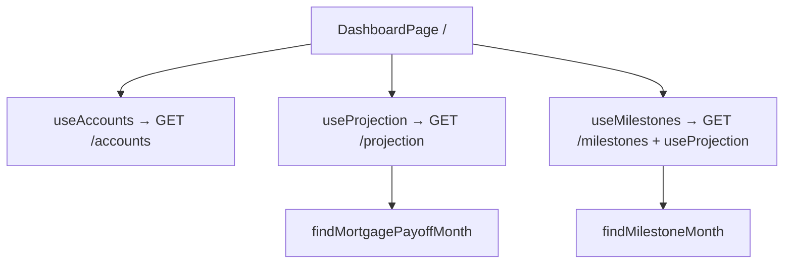

# 02 — Dashboard + Milestone Tracker

## Background

With the account and transaction core complete (see `01-account-transaction-core.md`),
the next layer is a dashboard that gives the user an immediate read on their
financial state. The dashboard has three sections: account overview, mortgage
countdown, and milestone tracker. All data is derived from existing API
endpoints — no new derived-metric endpoints are needed.

---

## Problem

Define the data model, component structure, and behaviour for:

- Account overview: current balances for all accounts
- Mortgage countdown: derived payoff estimate per Mortgage account
- Milestone tracker: user-defined balance targets with projected completion dates

---

## Questions and Answers

**Q1: What should the account overview section show?**
A: All accounts with their current balance. Total Liquid summary at the top.
Liabilities (Mortgage, CreditCard) visually distinct from assets. Current
balances only — no projection data.

**Q2: Does the account overview show forward-looking data?**
A: No. Current balances only. Projection data lives elsewhere.

**Q3: What does the mortgage countdown show and what drives it?**
A: Projected payoff month per Mortgage account (one countdown per account,
labelled by name). Derived client-side from `GET /projection` — scans 120
snapshots for the first month the Mortgage projected balance hits zero. Displays
current Restschuld + "X years Y months remaining". Hidden if no Mortgage account exists.

**Q4: Is a Milestone user-defined, system-computed, or both?**
A: User-defined only. User sets a name, target account, and target balance.
No system-generated milestones.

**Q5: What fields does a Milestone need?**
A: `name`, `accountId`, `targetBalance` (cents integer). System infers
crossing direction from AccountKind (upward for assets, downward for liabilities).

**Q6: What does the milestone tracker display per milestone?**
A: Name, target account name, target balance, estimated completion month.
If not reached within 120 months: "Not reached within 10-year horizon."

**Q7: Does milestone CRUD need edit?**
A: Create and delete only. Edit is low-value — easier to delete and recreate.

**Q8: Are milestones stored in MongoDB?**
A: Yes. `GET/POST /milestones`, `DELETE /milestones/:id`. Raw milestone records
only — no estimation on the server.

**Q9: Dashboard URL?**
A: `/` (root). Dashboard is the landing page; no auth screen in demo.

**Q10: Mortgage countdown — server endpoint or client-side?**
A: Client-side from `GET /projection`. No extra endpoint needed.

**Q11: Frontend feature split?**
A: Three features: `accounts`, `milestones`, `projection`. `DashboardPage`
composes all three.

**Q12: Milestone estimation — server or client?**
A: Client-side. `GET /milestones` returns raw records. Frontend scans
projection snapshots for the crossing point.

**Q13: Pure functions in `src/utils/` with tests?**
A: Yes. `findMilestoneMonth` and `findMortgagePayoffMonth` extracted as pure
functions so they can be tested in isolation.

**Q14: Multiple Mortgage accounts?**
A: One countdown per Mortgage account, each labelled by account name.

---

## Design

### Milestone model

```typescript
// Mongoose schema: server/src/models/Milestone.ts
interface Milestone {
  _id: string;
  name: string;
  accountId: string; // references Account._id
  targetBalance: number; // cents
}
```

### API

```
GET    /milestones          → Milestone[]
POST   /milestones          → 201 Milestone  (body: name, accountId, targetBalance)
DELETE /milestones/:id      → 204
```

✅ Raw CRUD — no estimation on the server  
❌ Server-side estimation — rejected to avoid duplicate projection calls

### Pure utility functions

```typescript
// src/utils/milestones.ts
function findMilestoneMonth(
  snapshots: MonthlySnapshot[],
  milestone: { accountId: string; targetBalance: number },
  accountKind: AccountKind
): string | null; // "YYYY-MM" or null if not reached

// src/utils/projection.ts (extends existing)
function findMortgagePayoffMonth(
  snapshots: MonthlySnapshot[],
  mortgageAccountId: string
): string | null;
```

Crossing direction inferred from `AccountKind`:

- Asset kinds (Girokonto, Tagesgeld, Investment, CreditCard): first month where `projected >= targetBalance`
- Mortgage: first month where `projected <= targetBalance` (typically 0)

### Frontend structure

```
src/
  pages/
    DashboardPage.tsx          ← default export, composition only
  features/
    accounts/
      useAccounts.ts           ← fetches GET /accounts, exposes account list
      AccountCard.tsx
      index.ts
    milestones/
      useMilestones.ts         ← fetches GET /milestones + GET /projection, computes estimated month
      MilestoneCard.tsx
      MilestoneForm.tsx
      index.ts
    projection/
      useProjection.ts         ← fetches GET /projection, exposes snapshots + mortgagePayoffMonth
      index.ts
  utils/
    milestones.ts              ← findMilestoneMonth (pure, tested)
```

### Mermaid: data flow



---

## Implementation Plan

**Phase 1 — Account overview**
Fetch `GET /accounts`, display all accounts with current balance. Show Total
Liquid at the top. Liability accounts visually distinct. Thin slice: data flows
from API to screen.

**Phase 2 — Mortgage countdown**
Add `useProjection` hook fetching `GET /projection`. Extract
`findMortgagePayoffMonth` pure function (with tests). Render one countdown
card per Mortgage account. Hidden if none.

**Phase 3 — Milestone tracker: read + create**
`GET/POST /milestones` backend. `useMilestones` hook. `findMilestoneMonth`
pure function (with tests). Display milestone list with estimated completion.
Add create form.

**Phase 4 — Milestone tracker: delete**
`DELETE /milestones/:id`. Delete button on each milestone card.

---

## Trade-offs

**Easier:**

- No new derived-metric endpoints — dashboard reuses `GET /accounts` and `GET /projection`
- Pure utility functions are trivially testable and reusable by AI features
- Three independent features decouple account, projection, and milestone concerns

**Harder:**

- Client-side estimation means two network calls (milestones + projection) on dashboard load
- If projection is slow, milestone estimated dates appear with a delay

**Explicitly out of scope:**

- Milestone editing (delete + recreate instead)
- Progress bars or percentage-to-goal indicators
- System-generated milestones (e.g. auto-detect "mortgage will be paid off")
- Transaction details on the dashboard (overview only)
