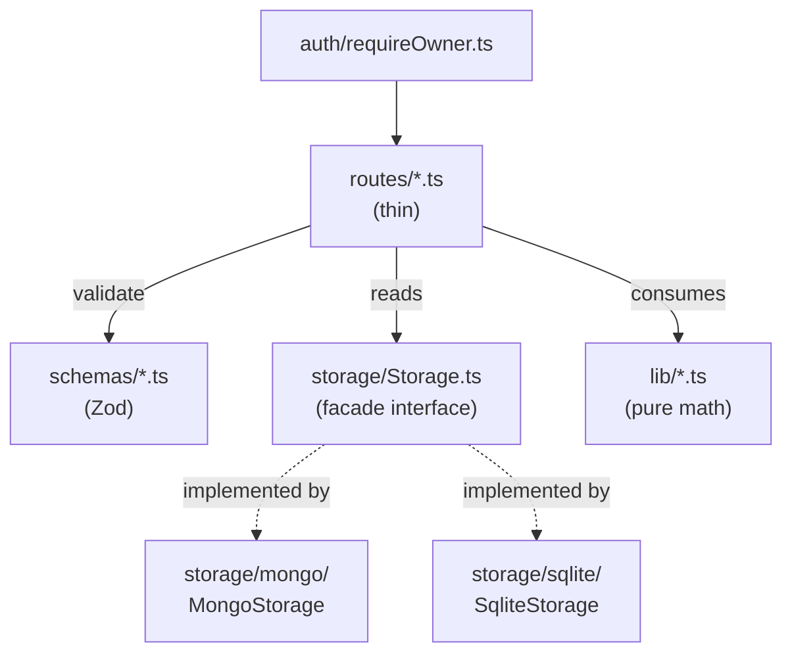

# 08 — Repository Abstraction

## Background

Horizon currently ships as a single web app talking to MongoDB Atlas. The
desktop / offline build (issue: Desktop Build Order in `CLAUDE.md`) needs the
same backend behaviour against local SQLite via `better-sqlite3`, with a
single switch (`STORAGE_DRIVER=sqlite|mongo`) deciding which store is used.

Today, route handlers in `server/src/routes/` import Mongoose models directly
and run mongoose-specific code inline (`mongoose.isValidObjectId`,
`Transaction.aggregate(...)`, `account._id`, `account.toJSON()`). None of that
survives a SQLite driver.

This log captures the design for a storage abstraction that:

- Lets the same Express app run against either Mongo or SQLite.
- Hardens the data layer against NoSQL injection and other input-shape
  attacks that the current direct-Mongoose pattern leaks.
- Establishes the auth posture for the cloud build and the offline posture
  for the desktop build — both of which are easier to reason about with a
  clean storage seam in place.

## Problem

Three problems must be solved together:

1. **Pattern.** Routes are tightly coupled to Mongoose. There is no seam at
   which a second driver could plug in.
2. **Security.** The Mongo-direct pattern allows malformed IDs and operator
   objects (`{ "$ne": null }`) to reach query construction. The desktop
   build, with no auth, must not accidentally bind a public socket. The
   cloud build, with auth as the only gate, must fail closed.
3. **Maintainability.** The abstraction must stay legible as the codebase
   grows. A monolithic `Storage` class with thirty methods is the wrong end
   state; so is five separate repository injectables wired through every
   route.

## Questions and Answers

**Q1 — Shape of the abstraction.**
✅ Single `Storage` interface (Repository Facade) with namespaced per-entity
repositories, each implementation split into per-entity files behind each
driver. Combines the Repository pattern with the Facade pattern; equivalent
to EF Core's `DbContext` + `DbSet<T>` shape and Prisma's client shape.
❌ Per-entity repositories injected separately — five constructors and five
mocks per touch point.
❌ Service layer above repos — overkill; routes are thin and the only
genuinely composed operation is transfers, which lives inside the repo.

**Q2 — Where the boundary lives in routes.**
✅ Routes call `storage.*` directly. Composition (e.g. account-with-balance,
transfer-creation) lives **inside** the repo because each driver implements
it differently (Mongo aggregation pipeline vs SQLite JOIN).
❌ Service layer — would be a pass-through for almost every route.

**Q3 — Tenancy model.**
✅ Single-tenant with auth gate. No `userId` on any model. Auth lives in
Express middleware on the cloud build only.
❌ Multi-tenant with per-record ownership — no signal that the cloud
deployment is meant to onboard other users; Google Auth is the doorman, not
a multi-tenancy primitive.

**Q4 — ID handling at the repo boundary.**
✅ Opaque string IDs. Repo methods accept `string` and return `null` for any
ID they cannot parse — never throw, never reflect input into a query. Kills
NoSQL injection by construction in the Mongo driver; no-op for SQLite
(parameterised queries are immune).
❌ Branded ID types validated at the route boundary — valid format depends
on the driver, so the validator can't live above the repo cleanly.

**Q5 — Input validation.**
✅ Zod schemas at the route boundary; repo accepts typed validated DTOs.
Validation happens at the system boundary where untrusted input enters.
❌ Repo validates everything — wrong chokepoint; internal callers
re-validate redundantly and error attribution gets confused.
❌ Static types only — types vanish at runtime; current `req.body as T`
pattern is a lie that compiles.

**Q6 — Atomicity for multi-step writes.**
✅ Hidden inside use-case methods (`transfers.create`, `transfers.delete`).
Each driver picks its own primitive: Mongo `session.withTransaction()`,
SQLite `db.transaction(...)` from `better-sqlite3`.
❌ Generic `storage.transaction(tx => ...)` wrapper — leaks driver semantics
(Mongo session passing, SQLite savepoint behaviour) and the only callers
would be the use-case methods anyway.

**Q7 — SQLite at-rest encryption.**
✅ Plaintext SQLite via `better-sqlite3`. DB path hard-coded by Electron
main to `app.getPath('userData')/horizon.db`, never read from env or IPC.
Express child binds `127.0.0.1` only. Driver written so SQLCipher
(`better-sqlite3-multiple-ciphers`) can swap in later as a one-line change
plus a `PRAGMA key`.
❌ SQLCipher now — key management adds a problem you can't make ergonomic;
OS-level full-disk encryption (BitLocker) covers the cold-disk-imaging
threat more cheaply.

**Q8 — Cloud auth posture.**
✅ Global `requireOwner` middleware mounted before all routes. Validates
Google ID token, checks `sub` claim against `OWNER_GOOGLE_SUB` allowlist of
one. Env-gated via `AUTH_DISABLED=1` on the desktop build. ID token in
`Authorization: Bearer` header — no cookie sessions, no CSRF surface, no
session store. SPA holds token in memory and refreshes via Google silent
refresh.
❌ Per-route middleware — wrong default for a single-tenant app; risks
forgetting to mount it on a future route.
❌ Any-signed-in-Google-user — would let any Gmail account read Carlos's
accounts.
❌ Cookie sessions via passport — adds CSRF surface and a session store for
no benefit.

**Q9 — SQLite schema management.**
✅ Hand-rolled SQL migrations in `server/src/storage/sqlite/migrations/`,
versioned via `PRAGMA user_version`. `migrate.ts` reads the pragma, runs
every higher-numbered file inside a transaction, bumps the pragma. Initial
seed of default categories lives at the end of `001_initial.sql`.
❌ Migration library (`umzug`, `node-pg-migrate`) — overkill for a personal
finance desktop app; ~10 migrations across the lifetime is the realistic
count.
❌ ORM with auto-migrate (Drizzle, Prisma, Kysely) — contradicts the point
of the repo facade; the facade _is_ our abstraction.

**Q10 — Driver selection and DI.**
✅ `createApp(storage: Storage): Express` takes storage as injected
dependency. `createStorage(driver)` factory in `server/src/storage/index.ts`
reads `STORAGE_DRIVER` at the entrypoint (`server.ts` for cloud, Electron
main for desktop) and passes the result in. Storage exposed to routes via
typed `app.locals.storage` (typed once with `declare module
"express-serve-static-core"`).
❌ `app.ts` constructs storage itself — couples the app to a specific
driver and makes tests harder.

**Q11 — DTO types as single source of truth.**
✅ `server/src/storage/types.ts` defines plain TypeScript types for
`Account`, `Transaction`, `Category`, `Milestone`, `RecurringTransaction`
with string IDs and primitive fields. Both drivers map their native
representation (Mongoose document / SQLite row) to these DTOs **inside the
repo**. Routes never see Mongoose docs, never call `.toJSON()`, never see
`_id`. Zod schemas in `schemas/` align with these DTOs so request
validation and storage shapes stay in lockstep.
❌ Driver-native types leaking through to routes — defeats the abstraction.

**Q12 — Composed/aggregate methods.**
✅ Belong on the entity they primarily concern (`accounts.findAllWithBalance`,
`accounts.findByIdWithBalance`, `accounts.getTotalLiquid`) and return their
own DTOs (e.g. `AccountWithBalance`). Each driver implements with its
native primitive. Pure, side-effect-free math (cashflow, projection) stays
in `server/src/lib/` and is **not** a repo concern — repos return raw rows,
`lib/cashflow.ts` and `lib/projection.ts` consume them.
❌ Pushing pure math into the repo — couples math to driver code, hurts
testability.
❌ Pulling aggregation up into routes — defeats the point of having a repo
that knows the right query primitive.

**Q13 — Transfers representation.**
✅ `transferId` stays as an indexed column on `transactions` in both drivers
(TEXT in SQLite). No separate `transfers` table.
❌ Promote transfers to their own table — adds a write, a migration, and a
referential-integrity surface for no semantic gain.

**Q14 — Parity testing.**
✅ Shared spec: `server/src/__tests__/storage.parity.ts` exports
`runStorageSpec(makeStorage: () => Promise<Storage>)`. Two thin test files
invoke it: `storage.mongo.test.ts` (factory uses `mongodb-memory-server`)
and `storage.sqlite.test.ts` (factory uses `better-sqlite3` with
`':memory:'`). Drift between drivers becomes impossible to merge.
❌ Driver-specific test suites only — drift goes undetected.

**Q15 — Cloud-only hardening middleware.**
✅ Mounted only when `AUTH_DISABLED` is unset:

- `helmet()` with defaults — security headers.
- `express-rate-limit` scoped to the `requireOwner` token-verification
  path only — prevents brute-force token guessing.
- Final error handler logs full errors server-side, responds with
  `{ error: "Internal server error" }` for unhandled 5xx — prevents
  stack-trace leakage. 4xx keep their specific error strings.
  ❌ Mount these on desktop build — no remote attacker, helmet's CSP can
  interfere with `file://`-loaded SPAs.

## Design

### File layout

```
server/src/
├── app.ts                          ← createApp(storage: Storage): Express
├── server.ts                       ← cloud entry: createStorage() + createApp() + listen
├── auth/
│   └── requireOwner.ts             ← Google ID token validation, allowlist of one
├── schemas/                        ← Zod schemas, one file per entity
│   ├── account.ts
│   ├── transaction.ts
│   ├── transfer.ts
│   ├── recurringTransaction.ts
│   └── milestone.ts
├── storage/
│   ├── Storage.ts                  ← public interface (the facade)
│   ├── types.ts                    ← shared DTOs
│   ├── index.ts                    ← createStorage(driver)
│   ├── mongo/
│   │   ├── MongoStorage.ts         ← assembles namespaces, owns connection
│   │   ├── accounts.ts
│   │   ├── transactions.ts
│   │   ├── transfers.ts
│   │   ├── categories.ts
│   │   ├── milestones.ts
│   │   └── recurringTransactions.ts
│   └── sqlite/
│       ├── SqliteStorage.ts        ← assembles namespaces, owns db handle
│       ├── migrate.ts              ← reads PRAGMA user_version, runs pending
│       ├── migrations/
│       │   └── 001_initial.sql
│       ├── accounts.ts
│       ├── transactions.ts
│       ├── transfers.ts
│       ├── categories.ts
│       ├── milestones.ts
│       └── recurringTransactions.ts
├── routes/                         ← thin handlers; read storage from app.locals
├── lib/                            ← pure functions: cashflow, projection
└── __tests__/
    ├── storage.parity.ts           ← shared spec
    ├── storage.mongo.test.ts
    └── storage.sqlite.test.ts
```

### Public interface (sketch)

```ts
// server/src/storage/types.ts
export interface Account {
  id: string;
  kind: AccountKind;
  name: string;
  openingBalance: number; // cents
  openingDate: string; // ISO
  sondertilgungAllowance?: number; // cents
}

export interface AccountWithBalance extends Account {
  balance: number; // cents
}

export interface Transaction {
  id: string;
  accountId: string;
  date: string; // ISO
  amount: number; // cents (negative = outflow)
  description: string;
  category: string;
  transferId?: string;
  recurringTransactionId?: string;
}
// ... Category, Milestone, RecurringTransaction
```

```ts
// server/src/storage/Storage.ts
export interface Storage {
  accounts: AccountsRepo;
  transactions: TransactionsRepo;
  transfers: TransfersRepo;
  categories: CategoriesRepo;
  milestones: MilestonesRepo;
  recurringTransactions: RecurringTransactionsRepo;
  close(): Promise<void>;
}

export interface AccountsRepo {
  findAll(): Promise<Account[]>;
  findById(id: string): Promise<Account | null>;
  findAllWithBalance(): Promise<AccountWithBalance[]>;
  findByIdWithBalance(id: string): Promise<AccountWithBalance | null>;
  getTotalLiquid(): Promise<number>;
  create(input: AccountCreateInput): Promise<Account>;
  update(id: string, input: AccountUpdateInput): Promise<Account | null>;
  delete(id: string): Promise<DeleteResult>; // includes 409-style "has transactions" signal
}

export interface TransactionsRepo {
  findAll(): Promise<Transaction[]>;
  findByAccount(
    accountId: string,
    opts?: { month?: string }
  ): Promise<Transaction[]>;
  findByTransferId(transferId: string): Promise<Transaction[]>;
  create(
    accountId: string,
    input: TransactionCreateInput
  ): Promise<Transaction | null>;
  update(
    id: string,
    input: TransactionUpdateInput
  ): Promise<Transaction | null>;
  delete(id: string): Promise<DeleteResult>; // refuses if part of a transfer
}

export interface TransfersRepo {
  create(input: TransferCreateInput): Promise<{ transferId: string } | null>;
  delete(transferId: string): Promise<boolean>;
}
// ... CategoriesRepo, MilestonesRepo, RecurringTransactionsRepo
```

### Architecture diagram



### Security posture

| Concern            | Cloud build                              | Desktop build                           |
| ------------------ | ---------------------------------------- | --------------------------------------- |
| Auth               | `requireOwner` global, allowlist of one  | None (`AUTH_DISABLED=1`)                |
| ID safety          | Opaque strings, repo returns `null`      | Same                                    |
| Input validation   | Zod at route boundary                    | Same                                    |
| Network exposure   | HTTPS, single allowed CORS origin        | Express binds `127.0.0.1` only, no CORS |
| Headers            | `helmet` defaults                        | None                                    |
| Rate limit         | On token-verification path               | None                                    |
| Error sanitization | 5xx returns `{ error: "..." }`, no stack | Same posture, less critical             |
| At-rest encryption | Atlas native (provider-level)            | Plaintext, OS user-account boundary     |
| DB path            | Mongo URI in env                         | Hard-coded `app.getPath('userData')`    |

## Implementation Plan

Each phase is a thin, working vertical slice. Phases ship incrementally
without breaking the running cloud app.

### Phase 1 — Storage interface + Mongo driver parity

Goal: cloud app runs identically, just with the seam in place.

1. Create `server/src/storage/types.ts` with all DTO types.
2. Create `server/src/storage/Storage.ts` with the facade interface and
   per-entity repo interfaces.
3. Create `server/src/storage/mongo/` with `MongoStorage.ts` and per-entity
   files. Each entity file maps Mongoose docs → DTOs at every boundary.
4. Create `server/src/storage/index.ts` with `createStorage(driver)`.
   Initially only `mongo` is supported.
5. Refactor `app.ts` to take `storage: Storage`, expose via `app.locals`,
   add typed augmentation.
6. Refactor every route to call `storage.*` instead of importing Mongoose
   models. Remove `mongoose.isValidObjectId` checks (repo handles
   unparseable IDs).
7. Refactor `server.ts` to `createStorage("mongo")` then `createApp(storage)`.
8. Move all existing route-level tests onto the storage abstraction.
9. Verify all tests pass against Mongo driver.

### Phase 2 — Zod validation at route boundary

10. Create `server/src/schemas/` with one Zod file per entity.
11. Replace ad-hoc `if (!field || !field2)` checks in every route with
    `Schema.safeParse(req.body)` → 400 with issue list.
12. Tighten DTO types: `CreateAccountInput = z.infer<typeof AccountCreateSchema>`.

### Phase 3 — SQLite driver

13. Add `better-sqlite3` dependency.
14. Write `001_initial.sql` covering all five tables with indexes:
    `accounts(kind)`, `transactions(account_id)`, `transactions(transfer_id)`,
    `transactions(date)`, `recurring_transactions(account_id)`,
    `recurring_transactions(is_active)`. Final block seeds default categories.
15. Implement `migrate.ts` (reads/writes `PRAGMA user_version`, runs
    migrations in order inside a transaction).
16. Implement `SqliteStorage.ts` and per-entity files. UUID generation via
    `crypto.randomUUID()`. Transfers use `db.transaction(...)`.
17. Extend `createStorage` to handle `"sqlite"`.

### Phase 4 — Parity tests

18. Write `storage.parity.ts` with `runStorageSpec(factory)`. Cover every
    repo method, including edge cases (unparseable IDs, transfer atomicity,
    delete-blocked-by-transactions).
19. Add `storage.mongo.test.ts` (uses `mongodb-memory-server`).
20. Add `storage.sqlite.test.ts` (uses `:memory:`).
21. Resolve any drift the parity suite uncovers.

### Phase 5 — Cloud auth + hardening

22. Add `auth/requireOwner.ts` (Google ID token validation, `sub`
    allowlist of one). Use `google-auth-library`'s `OAuth2Client.verifyIdToken`.
23. In `app.ts`, mount `helmet()`, `requireOwner` (when `!AUTH_DISABLED`),
    and `express-rate-limit` on the auth path. Add the sanitizing 5xx
    error handler last.
24. Update SPA fetch layer to attach `Authorization: Bearer <token>` from
    in-memory token store; add silent refresh.

Phases 1–4 unblock the desktop / Electron work (next design log).
Phase 5 can ship in parallel with Electron work since it only touches the
cloud build.

## Trade-offs

**What this design makes easier**

- Adding a third storage driver later (e.g. Postgres) — implement the same
  per-entity files in a new folder, register it in `createStorage`, run
  the parity spec.
- Testing — every test can use the SQLite `:memory:` driver for speed and
  zero external dependencies. Mongo-specific tests only run against
  driver-specific code.
- Reasoning about security — the entire data-layer attack surface
  collapses to "did this method validate its input?" with a uniform answer
  across drivers.
- Onboarding new code — entity-per-file means a new contributor finds
  exactly one place to read for "how do transactions work in storage".

**What this design makes harder**

- DTO drift — TypeScript types in `storage/types.ts`, SQL `CREATE TABLE`
  columns, and Zod schemas must be kept aligned by hand. Mitigation: the
  parity spec catches behavioural drift; type drift surfaces at compile
  time when DTOs change.
- Cross-entity queries — a join between, say, accounts and recurring
  transactions in a single query becomes a method on whichever entity
  owns the result, not a free-form query. This is intentional but means
  any future "show me everything about this account" view needs an
  explicit repo method, not a clever ad-hoc query.

**Explicitly out of scope**

- Multi-tenancy and `userId`-scoped queries. Single-tenant per Q3.
- A generic `storage.transaction(tx => ...)` wrapper. Atomicity hidden in
  use-case methods per Q6.
- SQLCipher / at-rest encryption on desktop. Plaintext SQLite per Q7;
  driver written so SQLCipher swap is a one-line change later.
- Cookie sessions / CSRF / passport. ID token in `Authorization` header
  per Q8.
- ORM-managed migrations. Hand-rolled SQL per Q9.
- A separate `transfers` table. Transfers remain an indexed `transferId`
  column per Q13.
- Fine-grained rate limiting on data routes. Single-tenant + auth gate
  makes this YAGNI; only the auth path itself is rate-limited per Q15.
