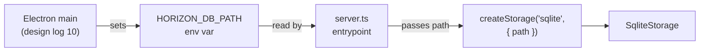

# 09 — SQLite Driver (Offline Storage)

## Background

Design log `08-repository-abstraction.md` established the Storage facade
and shipped the SQLite driver's domain layer: `SqliteStorage`, per-entity
repos (`accounts.ts`, `transactions.ts`, `transfers.ts`, `categories.ts`,
`milestones.ts`, `recurringTransactions.ts`), migrations 001 + 002, and a
parity spec (`storage.parity.ts`) running against `:memory:` for both the
Mongo and SQLite drivers.

What that log did not specify is the **operational shape** of the SQLite
driver as the storage backbone of the Desktop Build:

- Connection-level pragmas (only `foreign_keys = ON` is set today, inside
  `migrate.ts`).
- How the DB file path is decided at runtime.
- First-run experience when the file doesn't exist.
- Future migration policy and rollback story.
- Backup, restore, and integrity handling.
- Driver-level logging.
- Performance tuning (mmap, vacuum).
- File-based test coverage to complement `:memory:`.
- Entity row → DTO mapping convention.
- UUID generation strategy.
- Mongo↔SQLite divergences worth documenting.
- `close()` semantics under WAL.

This log fills those gaps so the `SQLite driver (offline storage)`
build-status box can be ticked.

## Problem

The domain layer of the SQLite driver passes parity, but the operational
layer is unspecified. Personal-finance data demands clear answers on:

1. **Durability and crash safety** — what happens if the process dies
   mid-write, or the OS power-cycles?
2. **Backup / restore** — Carlos's actual finance data lives in a single
   file on his machine. Losing it is unacceptable, and a finance app has
   to give a clear answer to "how do I save and restore this?"
3. **Schema evolution** — once the desktop app ships, future schema
   changes must apply against an existing DB without manual intervention
   and without a downgrade path.
4. **Integrity** — silent corruption is the worst possible failure mode.
   Detection at startup is non-negotiable; auto-recovery is unacceptable.
5. **Path coupling** — the driver must not know about Electron, but the
   Electron shell must be able to tell the driver where to put the file.
6. **Operational hygiene** — pragmas, mmap, logging defaults, `close()`
   semantics — quietly applied so they aren't an afterthought when the
   shell lands in design log 10.

## Questions and Answers

**Q1 — Connection pragmas.**
✅ Per-connection: `journal_mode = WAL`, `synchronous = NORMAL`,
`busy_timeout = 5000`, `foreign_keys = ON`, `mmap_size = 67108864` (Q8).
Applied in `SqliteStorage.ts` at construction, not in `migrate.ts`.
Rationale: WAL is crash-safe and the better-sqlite3-recommended default.
`synchronous = NORMAL` under WAL is durable across process crashes; only
power loss can lose the in-flight transaction, an acceptable tradeoff
for a personal-finance app on the user's own disk. `busy_timeout`
defends against accidental future second connections (e.g. backup
reader). Pragmas are connection state, not schema state — keeping them
out of `migrate.ts` keeps responsibilities clean.
❌ Default rollback journal + `synchronous = FULL` — slower, no real
safety win for this threat model, doubles `fsync` calls.
❌ Pragmas in `migrate.ts` — schema migrations and connection tuning are
distinct concerns; bundling them confuses the seam.

**Q2 — DB path resolution at runtime.**
✅ `createSqliteStorage(path)` stays a pure function of its `path`
argument. The path is decided by the entrypoint and arrives via the
`HORIZON_DB_PATH` env var. The Electron main process (design log 10)
will set it to `app.getPath('userData') + '/horizon.db'` when spawning
the Express child. Local dev defaults to `./horizon.db`.
❌ Driver reads `app.getPath('userData')` itself — couples the driver to
Electron, breaks tests and headless CLI use.
❌ IPC handshake to receive the path — adds a moving part for a value
already known at spawn time.

**Q3 — First-run / DB-doesn't-exist semantics.**
✅ Implicit. Opening a missing path lets better-sqlite3 create the file;
`migrate()` runs all migrations from version 0; `001_initial.sql` seeds
default categories. No explicit init step, no sample accounts.
❌ Separate "init DB" command — a personal app shouldn't have a setup
step.
❌ Seed sample accounts on first run — pollutes a real user's data
store; the empty-state UI handles "no accounts yet".

**Q4 — Future migration policy.**
✅ Forward-only, append-only. Each schema change is a new
`NNN_description.sql` file. Migrations are never edited after shipping.
All pending migrations apply inside one transaction (already
implemented). `PRAGMA user_version` is the source of truth for what's
been applied. Add a test asserting `migrate()` is a no-op when
`user_version` is already at the latest.
❌ Down-migrations — single-user offline app has no fleet to coordinate
rollback against; restore-from-backup is the rollback path.
❌ Editing existing migration files post-ship — silent divergence
between installs that ran the old version and ones that didn't.

**Q5 — Backup & restore strategy.**
✅ Two methods on the SQLite driver:

- `Storage.backup(destPath: string): Promise<void>` — uses
  better-sqlite3's online backup API (`db.backup(destPath)`), safe
  while the DB is open and aware of WAL.
- `Storage.restore(srcPath: string): Promise<void>` — closes storage,
  validates source via `PRAGMA integrity_check` and
  `PRAGMA user_version <= currentMigrationVersion`, copies file in,
  reopens.
  Mongo driver throws `Error("not supported")` for both, keeping the
  interface honest.
  ❌ Plain file copy of `horizon.db` — misses `-wal` / `-shm`, risks a
  torn snapshot.
  ❌ Auto-backup on every write — too noisy. Daily snapshot to
  `userData/backups/horizon-YYYY-MM-DD.db` (kept 7) flagged for the
  Electron shell design log, not this one.

**Q6 — Corruption / integrity handling.**
✅ On startup, after `migrate()`, run `PRAGMA integrity_check`. Anything
other than `ok` throws a typed `StorageIntegrityError`. The Electron
shell surfaces a dialog: "Database appears corrupted — restore from
backup?". No automatic recovery.
❌ Silent recovery attempts — finance data; never silently "fix"
anything.
❌ Skipping the check — corruption should fail loud at startup, not at
the first failing query.

**Q7 — Driver-level logging.**
✅ Driver itself logs nothing. Errors propagate as thrown `Error`s with
sanitized messages (no SQL string in the message). Express's error
middleware decides what reaches the client. Optional `DEBUG_SQL=1`
enables query tracing in dev only.
❌ Always-on query logging — disk noise on the user's machine for no
benefit.

**Q8 — Performance: indices, vacuum, mmap.**
✅ Existing indices cover hot paths: `accounts(kind)`,
`transactions(account_id)`, `transactions(transfer_id)`,
`transactions(date)`, `recurring_transactions(account_id)`,
`recurring_transactions(is_active)`. Add `mmap_size = 67108864` (64 MB)
to per-connection pragmas. No automatic VACUUM; manual "Optimize
database" menu item is a later add only if the file ever grows enough
to matter.
❌ Aggressive index sprawl now — add when a query gets slow.
❌ Auto-VACUUM — meaningful pause, near-zero benefit for personal-scale
data.

**Q9 — `:memory:` vs file-based tests.**
✅ Parity spec keeps using `:memory:`. Add one tempfile-based case in
`migrate.test.ts` covering open → close → reopen, asserting
`user_version` persists and re-running `migrate()` is a no-op. Catches
the class of bug `:memory:` can't see.
❌ Duplicate the entire parity suite against tempfiles — diminishing
returns and test-runtime cost.

**Q10 — Row → DTO mapping convention.**
✅ Each per-entity SQLite repo owns its own `toXDTO(row)` mapper at the
top of the file (already the pattern in `accounts.ts`). Mappers stay
local to the SQL that produces them.
❌ Central `mappers.ts` — once two entities share a column name (`name`,
`id`), shared mappers become a footgun.

**Q11 — UUID generation strategy.**
✅ `crypto.randomUUID()` (v4) at insert time. Reads validated by
`isValidUuid` to keep the same opaque-string contract the Mongo driver
presents. Default categories use deterministic v4 UUIDs hard-coded in
`001_initial.sql` so seeded IDs are stable across installs.
❌ Auto-increment integer IDs — would diverge from the Mongo driver's
string-ID contract and break the parity spec.

**Q12 — Schema-parity gotchas to document.**
✅ Short `server/src/storage/sqlite/README.md` documenting:

- SQLite enforces FKs (Mongo doesn't).
- SQLite has no native arrays / nested objects (n/a — DTOs are flat).
- Booleans stored as `INTEGER 0|1` (e.g. `is_active`) — already mapped
  in repo code.
- Default collation is binary; UNIQUE on `categories.name` is
  case-sensitive. If case-insensitive lookup is ever needed, switch to
  `COLLATE NOCASE` in a migration.
  ❌ Backporting Mongo into FK behaviour for parity — wrong direction;
  the parity spec already covers the cases that matter.

**Q13 — `close()` semantics under WAL.**
✅ `close()` runs `PRAGMA wal_checkpoint(TRUNCATE)` then `db.close()`.
Idempotent — second call is a no-op. Truncating the WAL on close means
the on-disk `.db` is the canonical state at shutdown, simplifying the
backup story (no orphan `-wal` after a clean exit).
❌ Plain `db.close()` — leaves a `-wal` file behind that confuses backup
tooling and external inspection.

**Q14 — Build-status semantics.**
✅ Tick the `SQLite driver (offline storage)` checkbox in `CLAUDE.md`
once Q1–Q13 are implemented and the parity suite still passes. The
Electron shell remains a separate item (design log 10).
❌ Tick now on the strength of the existing domain code — operational
hardening isn't there yet.

## Design

### File layout (delta from log 08)

```
server/src/storage/sqlite/
├── SqliteStorage.ts         ← + per-connection pragmas, integrity_check,
│                              checkpoint-on-close, backup(), restore()
├── migrate.ts               ← unchanged (foreign_keys stays here for now,
│                              moves to SqliteStorage in implementation)
├── migrations/
│   ├── 001_initial.sql      ← unchanged
│   └── 002_foreign_keys.sql ← unchanged
├── errors.ts                ← + StorageIntegrityError
├── README.md                ← + parity-gotchas reference (Q12)
└── (per-entity repo files unchanged)

server/src/__tests__/
├── migrate.test.ts          ← + tempfile open→close→reopen idempotency
└── storage.parity.ts        ← unchanged (still :memory:)
```

### Public interface (delta)

```ts
// server/src/storage/Storage.ts
export interface Storage {
  // ...existing namespaces unchanged
  close(): Promise<void>;
  backup(destPath: string): Promise<void>; // SQLite only; Mongo throws
  restore(srcPath: string): Promise<void>; // SQLite only; Mongo throws
}
```

```ts
// server/src/storage/sqlite/errors.ts
export class StorageIntegrityError extends Error {
  constructor(detail: string) {
    super(`SQLite integrity check failed: ${detail}`);
    this.name = "StorageIntegrityError";
  }
}
```

```ts
// server/src/storage/sqlite/SqliteStorage.ts (sketch)
const PRAGMAS = [
  "journal_mode = WAL",
  "synchronous = NORMAL",
  "busy_timeout = 5000",
  "foreign_keys = ON",
  "mmap_size = 67108864",
];

export async function createSqliteStorage(path: string): Promise<Storage> {
  const db = new Database(path);
  for (const p of PRAGMAS) db.pragma(p);
  await migrate(db);
  const integrity = db.pragma("integrity_check", { simple: true });
  if (integrity !== "ok") throw new StorageIntegrityError(String(integrity));
  // ...repos as today
  return {
    // ...,
    async close() {
      db.pragma("wal_checkpoint(TRUNCATE)");
      db.close();
    },
    async backup(destPath) {
      await db.backup(destPath);
    },
    async restore(srcPath) {
      /* see Q5 */
    },
  };
}
```

### Path resolution



The driver itself never reads `process.env`. The entrypoint resolves
`HORIZON_DB_PATH ?? './horizon.db'` and hands the path in.

## Implementation Plan

### Phase 1 — Per-connection pragmas

1. Add `PRAGMAS` constant and apply at the top of `createSqliteStorage`.
2. Remove `db.pragma("foreign_keys = ON")` from `migrate.ts` (now owned
   by the driver, not the schema layer).
3. Verify parity suite still passes.

### Phase 2 — Integrity check + StorageIntegrityError

4. Add `errors.ts` with `StorageIntegrityError`.
5. Run `PRAGMA integrity_check` after `migrate()` in
   `createSqliteStorage`; throw on non-`ok`.
6. Add a parity-bypassing test that opens a deliberately corrupted
   tempfile and asserts the typed error.

### Phase 3 — `close()` checkpoint

7. Update `close()` to run `PRAGMA wal_checkpoint(TRUNCATE)` then
   `db.close()`. Make idempotent.
8. Tempfile test: write, close, assert no `-wal`/`-shm` left behind.

### Phase 4 — Backup / restore on the Storage interface

9. Extend `Storage` interface with `backup(destPath)` and
   `restore(srcPath)`.
10. Implement in SQLite driver using `db.backup(destPath)` and the
    validated-copy-and-reopen flow.
11. Implement in Mongo driver as `throw new Error("not supported")`.
12. Parity spec adds: backup against SQLite produces a file that
    re-opens cleanly with the same data; backup against Mongo throws.

### Phase 5 — Migration idempotency test

13. Add a tempfile-based case to `migrate.test.ts` covering
    open → close → reopen and asserting `migrate()` is a no-op when
    `user_version` is current.

### Phase 6 — Path resolution at the entrypoint

14. Update `server.ts` so `STORAGE_DRIVER=sqlite` reads
    `HORIZON_DB_PATH ?? './horizon.db'` and passes it through.
15. Document the env var in `CLAUDE.md` under Environment Variables.

### Phase 7 — Documentation

16. Write `server/src/storage/sqlite/README.md` covering parity gotchas
    (FKs, INTEGER booleans, binary collation), the pragma list with
    rationale, and the migration / backup / restore policy.

### Phase 8 — Build-status flip

17. Tick `SQLite driver (offline storage)` in `CLAUDE.md` once Phases
    1–7 are merged and the parity suite is green.

## Trade-offs

**What this design makes easier**

- **Crash safety** — WAL + integrity check on startup means power loss
  or process crash either replays cleanly or fails loud.
- **Backup story** — `db.backup(destPath)` is one call; the Electron
  menu wiring later in design log 10 is trivial.
- **Schema evolution** — append-only migrations + a `user_version`
  source of truth means the desktop app upgrades silently across
  versions without per-install fixup.
- **Reasoning about the driver** — pragmas live with the connection,
  schema lives with migrations, integrity check lives at startup. Each
  concern has one home.

**What this design makes harder**

- **No down-migrations** — schema mistakes can't be rolled back per
  install; restore-from-backup is the only path. Mitigated by keeping
  migrations small and reviewable, and by daily snapshots once the
  Electron shell lands.
- **Backup/restore on the Storage interface** — the abstraction now
  has two methods that only the SQLite driver implements meaningfully.
  The Mongo driver's `throw "not supported"` is an honest signal but
  is still asymmetry in the facade. The alternative — pushing
  backup/restore out of the interface entirely and into a SQLite-only
  module — would force callers to know which driver they have, which
  is exactly what the facade is meant to hide.

**Explicitly out of scope**

- **Electron main path resolution** — design log 10. This log only
  specifies the env var seam.
- **Daily auto-backup snapshots** — design log 10 (Electron shell).
- **At-rest encryption (SQLCipher)** — design log 08 already deferred
  this; nothing changes here.
- **Connection pooling / multi-process access** — better-sqlite3 is
  synchronous and the desktop app is single-process. If a future
  feature needs a second connection (e.g. background backup reader),
  the `busy_timeout` pragma already covers contention; no further
  design needed yet.
- **Down-migrations / schema rollback** — explicitly rejected per Q4.
- **Always-on query logging** — explicitly rejected per Q7.
