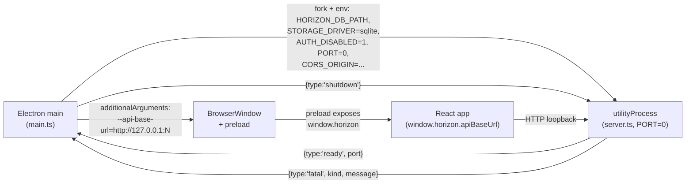
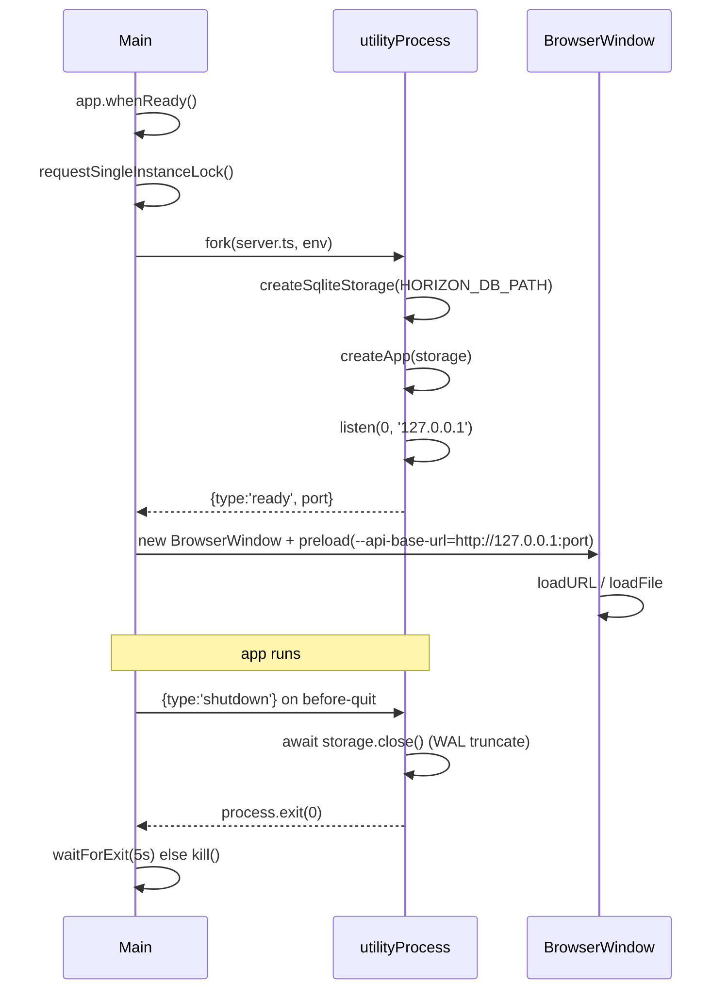

# 10 — Electron Desktop Shell

## Background

Design logs `08-repository-abstraction.md` and `09-sqlite-driver-offline-storage.md`
shipped the `Storage` facade and a SQLite driver behind a
`STORAGE_DRIVER=sqlite|mongo` env switch. The driver is a pure function of
its `path` argument — it never reads `app.getPath('userData')` or anything
Electron-aware. Log 09 (Q2) explicitly deferred the `HORIZON_DB_PATH`
producer to this log: "the Electron main process (design log 10) will set
it to `app.getPath('userData') + '/horizon.db'` when spawning the Express
child."

This log specifies the desktop shell that wraps the existing React
frontend and Express server into a single offline application Carlos runs
day-to-day. Packaging (`electron-builder`, Windows installer, code signing)
is **not** in scope here — that lands in design log 11.

## Problem

The frontend and server work today as a two-process web app. Turning
that into a desktop application raises distinct questions:

1. **Process model.** How does the main process run the Express server —
   inline, as a Node child, or via Electron's first-class
   `utilityProcess`?
2. **Port allocation.** A fixed `PORT=3001` collides with `npm run server:dev`
   and any other dev tool the user has running. How does the renderer
   discover a dynamic port?
3. **Renderer source.** Vite dev server in dev, built `dist/index.html`
   in prod — how does main pick between them, and how does the renderer
   pick up the API base URL?
4. **Security posture.** What does `contextIsolation`/`sandbox`/preload
   look like for a single-window single-user desktop app where the only
   bridge needed is "tell the renderer where the loopback API lives"?
5. **Lifecycle.** SQLite under WAL needs `storage.close()` on shutdown
   to truncate the WAL (log 09 Q13). What's the orderly handshake
   between main and the server child on quit?
6. **DB path wiring.** Main owns `HORIZON_DB_PATH`. How does that env
   var reach the utilityProcess, and where does the file land?
7. **Errors at startup.** `StorageIntegrityError` is the canonical
   loud-fail surface from log 09 Q6. Where does the user see it?
8. **Dev workflow.** What does `npm run electron:dev` actually do, and
   how do we keep `npm run dev` / `npm run server:dev` working untouched
   for the cloud build?

## Questions and Answers

**Q1 — Process model for the Express server.**
✅ Electron's `utilityProcess.fork()`. First-class API for non-renderer
Node children, inherits Electron's bundled Node so packaging doesn't
ship a second runtime, and gives main a clean `MessagePort` for the
ready / shutdown handshake `better-sqlite3`'s WAL-truncate-on-close
needs.
❌ `child_process.spawn('node', ...)` — duplicates the runtime; ships a
second binary in the installer.
❌ `child_process.fork()` — same effect as utilityProcess minus the
purpose-built IPC ergonomics.
❌ In-process import of `createApp` — tangles `better-sqlite3`'s native
bindings with the renderer's V8 isolate and erases the seam log 08+09
were built around.

**Q2 — Folder structure.**
✅ New top-level `electron/`, peer to `server/` and `src/`. Contains
`main.ts` (app lifecycle, BrowserWindow, utilityProcess), `preload.ts`
(context-isolated bridge, minimal), `serverHandle.ts` (utilityProcess
wrapper with start / stop / ready handshake), `paths.ts` (userData / DB
path resolution).
❌ `desktop/` — `electron/` is the conventional name and matches
`electron-builder` defaults.
❌ Co-locating in `server/` — different runtime, different lifecycle,
different deps.

**Q3 — Main process language and build.**
✅ TypeScript, compiled with `tsc` to `electron/dist/` via a dedicated
`electron/tsconfig.json` (`module: NodeNext`, `target: ES2022`,
`outDir: ./dist`). Script `electron:build` runs `tsc -p electron`. No
bundler — three files, no tree-shaking gain.
❌ esbuild / vite-electron plugins — extra moving parts; the project
already uses plain `tsc` for the server.
❌ Plain JS — would be the only JS surface in the repo.

**Q4 — Renderer source: dev vs prod.**
✅ Dev: `loadURL('http://localhost:5173')` (Vite dev server) when
`!app.isPackaged`. Prod: `loadFile(path.join(app.getAppPath(),
'dist/index.html'))`.
❌ Always loading built assets — kills HMR.
❌ Bundling Vite into main — unnecessary; we point `loadURL` at the
existing dev server.

**Q5 — Server port allocation.**
✅ Ephemeral. Main passes `PORT=0` to the utilityProcess; server binds,
reads `server.address().port`, posts the actual port back to main as
part of the `{ type: 'ready', port }` message.
❌ Fixed `3001` — collides with `npm run server:dev`.
❌ Probing free ports from main — racy; the server is the authority on
its own bound port.

**Q6 — Renderer → API base URL.**
✅ Main passes the resolved port to the renderer via `preload.ts` using
`contextBridge.exposeInMainWorld('horizon', { apiBaseUrl, platform })`.
The frontend's existing API client reads
`window.horizon?.apiBaseUrl ?? import.meta.env.VITE_API_BASE_URL` so
the same code path works in browser-dev and Electron.
❌ Hardcoding `http://localhost:3001` — incompatible with Q5.
❌ Custom `horizon://` protocol with intercepted fetch — overkill;
HTTP loopback to a known port matches the cloud build.

**Q7 — Preload + security posture.**
✅ `contextIsolation: true`, `nodeIntegration: false`, `sandbox: true`,
`webSecurity: true`. Preload exposes exactly one object:
`window.horizon = { apiBaseUrl: string, platform: 'electron' }`. No
file system, no DB, no shell — the renderer talks to the server over
HTTP, same as the cloud build.
❌ `nodeIntegration: true` — defeats the seam and the parity with web.
❌ Exposing storage methods through IPC — Express is already that
boundary.

**Q8 — Auth in the desktop build.**
✅ Main spawns the utilityProcess with `AUTH_DISABLED=1`. `app.ts`
already short-circuits `requireOwner`, helmet, and rate-limiting on
that flag — no new code.
❌ Always-on auth with a synthetic local user — ceremony for a
single-user offline app.

**Q9 — CORS and bind address.**
✅ Server binds `127.0.0.1` explicitly so off-box traffic can never
reach it. Main passes `CORS_ORIGIN=http://localhost:<vitePort>` in dev
(matching the Vite dev server origin); in prod the renderer is
`file://` and we pass `CORS_ORIGIN=*` — safe because the server is
loopback-only.
❌ Disabling CORS entirely — the env var is fine; we just feed it the
right origin.
❌ Binding to `0.0.0.0` — the desktop server must never accept off-box
traffic.

**Q10 — DB path + data directory.**
✅ Main resolves `path.join(app.getPath('userData'), 'horizon.db')` and
passes it to the utilityProcess as `HORIZON_DB_PATH`. The driver still
reads `HORIZON_DB_PATH` exactly as log 09 Q2 specified — no Electron
coupling in the driver. Backups directory `userData/backups/` is
created lazily on first backup, not at startup.
❌ Driver calling `app.getPath` directly — coupling rejected in log 09 Q2.
❌ DB next to the .exe — Windows installers commonly land in
`Program Files`, not user-writable.

**Q11 — Startup sequence.**
✅ Strict order: (1) `app.whenReady()`; (2) `requestSingleInstanceLock`
(Q14); (3) `serverHandle.start()` forks the utilityProcess and awaits
the `{ type: 'ready', port }` message with a 10s timeout; (4)
BrowserWindow created with the resolved port injected via preload
`additionalArguments`; (5) `loadURL` / `loadFile`. Failure in 2–4
surfaces a fatal `dialog.showErrorBox` and quits.
❌ Open the window first, lazily start the server — produces a flash of
broken UI.
❌ No timeout on the ready handshake — a hung server should fail loud.

**Q12 — Shutdown sequence.**
✅ On `before-quit`: send `{ type: 'shutdown' }` to the utilityProcess;
server `await storage.close()` (which truncates the WAL per log 09
Q13), then `process.exit(0)`; main waits up to 5s for the
utilityProcess `exit` event, then `kill()` as a last resort. Critical
because WAL checkpoint on close is the entire backup contract.
❌ `app.exit()` from main without draining the child — risks an
orphaned `-wal` file.
❌ Relying on OS process-tree teardown — non-deterministic ordering.

**Q13 — Integrity / startup error surfacing.**
✅ The utilityProcess catches `StorageIntegrityError` (and any thrown
error from `createSqliteStorage`) and posts `{ type: 'fatal', kind:
'integrity' | 'unknown', message }` to main. Main shows a
`dialog.showMessageBox` with two buttons: **Quit** and **Show data
folder** (`shell.showItemInFolder` on the DB file). No
restore-from-backup UI — the actual backup _creation_ path doesn't
ship until the desktop-ops design log, so a manual-restore affordance
now would be premature.
❌ Auto-restore — log 09 Q6 explicitly rejected silent recovery.
❌ Swallowing and showing a blank window — finance app; never silent.

**Q14 — Single-instance lock + window basics.**
✅ `app.requestSingleInstanceLock()`; second-launch focuses the
existing window. One `BrowserWindow`, 1280×800 default, `show: false`
until `ready-to-show` to avoid white flash. Default OS chrome.
DevTools opens automatically in dev only. Default Electron application
menu in dev; a minimal File / Edit / View / Window / Help menu in prod
with no custom items yet — backup, export, optimize-DB are deferred to
their own design log.
❌ Multiple windows — out of scope; the app is single-document.
❌ Frameless / custom titlebar — design churn for no functional gain.

**Q15 — Dev workflow scripts.**
✅ Three new package.json scripts:

- `electron:build` → `tsc -p electron`
- `electron:dev` → `concurrently "vite" "tsx watch electron/main.ts"`;
  main detects dev via `!app.isPackaged` and points the renderer at
  `http://localhost:5173`. `tsx` runs the TS main directly; no compile
  step in dev.
- `electron:start` → `npm run build && npm run electron:build && electron
  electron/dist/main.js`, exercising the prod path locally.
  Add `concurrently` and `electron` as devDeps. Existing `dev` and
  `server:dev` scripts stay untouched — the cloud build is unaffected.
  ❌ A single mega-script orchestrating Vite, server, and Electron —
  `electron:dev` already does this; the cloud build still wants `dev` +
  `server:dev` to work standalone.
  ❌ `vite-plugin-electron` — replaces `concurrently` with a heavier
  abstraction we don't need.

**Q16 — Logging from the utilityProcess.**
✅ The child's stdout / stderr is piped to main and tagged `[server]`
before being printed to main's stdout. In dev that surfaces in the
terminal that launched `electron:dev`; in prod it disappears
(acceptable — log 09 Q7 already established the driver is silent by
default, and we don't want a log file accumulating on the user's
disk). A persistent log file is a future-log item, not now.
❌ Writing to `userData/horizon.log` immediately — premature; no
consumer yet.
❌ Suppressing child output in dev — kills debuggability.

**Q17 — Renderer build location.**
✅ Vite already outputs to `dist/`. Main resolves prod renderer path as
`path.join(app.getAppPath(), 'dist/index.html')`. No `vite.config.ts`
change needed.
❌ Custom `outDir` — gratuitous churn.

**Q18 — Out of scope.**

- `electron-builder` config, code signing, Windows installer — design
  log 11 (Desktop Packaging).
- Daily auto-backup snapshots, backup / restore menu items, "Show in
  Explorer" data-folder menu — folded into a future Desktop Ops log
  alongside the menu chrome.
- Auto-update channel — out of scope until the app has shipped once.
- macOS / Linux builds — Carlos is on Windows; cross-platform is
  opportunistic.
- IPC beyond the server-handle handshake — renderer talks to the
  server over HTTP, full stop.
- Native menus for Quit, Preferences, etc. beyond Electron defaults.
- SQLCipher / at-rest encryption — already deferred in log 08.

## Design

### File layout

```
electron/
├── main.ts             ← app lifecycle, BrowserWindow, single-instance lock,
│                          startup/shutdown sequencing, fatal-error dialog
├── preload.ts          ← contextBridge.exposeInMainWorld('horizon', {...})
├── serverHandle.ts     ← utilityProcess wrapper: start(), stop(),
│                          waitForReady(timeoutMs), pipe stdio with [server] tag
├── paths.ts            ← resolveDbPath(): app.getPath('userData') + '/horizon.db'
├── tsconfig.json       ← module: NodeNext, target: ES2022, outDir: ./dist
└── dist/               ← tsc output (gitignored)
```

```
src/lib/apiBaseUrl.ts   ← window.horizon?.apiBaseUrl ?? import.meta.env.VITE_API_BASE_URL
src/types/horizon.d.ts  ← global Window.horizon declaration
```

### Process and message shape



### Public surface (delta on `server.ts`)

`server/src/server.ts` already resolves `HORIZON_DB_PATH` and
`STORAGE_DRIVER` from `process.env`. Two additions:

1. Bind the listener to `127.0.0.1` explicitly:
   `app.listen(PORT, '127.0.0.1', () => { ... })`.
2. When invoked as a utilityProcess (detected via
   `process.parentPort != null`), capture the bound port from
   `server.address()`, post `{ type: 'ready', port }`, and listen for
   `{ type: 'shutdown' }` to call `await storage.close()` then
   `process.exit(0)`. Fatal errors during startup post
   `{ type: 'fatal', ... }` and exit non-zero.
3. Listen-error and uncaught throws during `createSqliteStorage`
   propagate as `{ type: 'fatal' }` rather than dying silently.

### Preload surface

```ts
// electron/preload.ts
import { contextBridge } from "electron";

const apiBaseUrlArg = process.argv.find((a) => a.startsWith("--api-base-url="));
const apiBaseUrl = apiBaseUrlArg?.split("=")[1] ?? "";

contextBridge.exposeInMainWorld("horizon", {
  apiBaseUrl,
  platform: "electron" as const,
});
```

```ts
// src/types/horizon.d.ts
export {};
declare global {
  interface Window {
    horizon?: { apiBaseUrl: string; platform: "electron" };
  }
}
```

### Startup / shutdown sequence



## Implementation Plan

### Phase 1 — utilityProcess seam in `server.ts`

1. Add `127.0.0.1` bind, parent-port detection, ready / fatal /
   shutdown message handlers in `server/src/server.ts`. Existing CLI
   behaviour (no parent port) is unchanged.
2. Add a unit test for the parent-port handshake using a mocked
   `process.parentPort` (or extract the handshake into a small
   testable helper).

### Phase 2 — Electron skeleton

3. Create `electron/` with `main.ts`, `preload.ts`, `serverHandle.ts`,
   `paths.ts`, `tsconfig.json`. Add `electron` and `concurrently` as
   devDeps.
4. Add `electron:build` and `electron:dev` scripts. `electron:dev`
   launches the existing Vite dev server side-by-side and runs main
   under `tsx watch`.
5. Wire `serverHandle.start()` to fork `server/src/server.ts` (in dev,
   via `tsx`-resolvable path; in prod, the compiled `server/dist`
   path) with the right env, and resolve a `Promise<number>` on the
   `ready` message with a 10s timeout.

### Phase 3 — Renderer bridge

6. `preload.ts` exposes `window.horizon = { apiBaseUrl, platform }`
   from `--api-base-url=` argument injected via `additionalArguments`.
7. Add `src/lib/apiBaseUrl.ts` and `src/types/horizon.d.ts`. Update
   the existing API client(s) to prefer `window.horizon?.apiBaseUrl`.
8. Smoke test: launch `electron:dev`, account list loads from the
   loopback Express, no console CORS errors.

### Phase 4 — Lifecycle hardening

9. `before-quit` handler sends `{ type: 'shutdown' }`, waits up to 5s
   for the child's exit, kills as a last resort.
10. `fatal` message path → `dialog.showMessageBox` with **Quit** and
    **Show data folder** (`shell.showItemInFolder` on the DB file).
11. `requestSingleInstanceLock`; second-launch focuses the existing
    window via the `second-instance` event.
12. `ready-to-show` gating on `BrowserWindow` to avoid white flash.

### Phase 5 — Prod path verification

13. `electron:start` script chains `npm run build && npm run electron:build`
    and launches `electron electron/dist/main.js` against the built
    renderer. Verify `loadFile` path and `app.isPackaged`-equivalent
    branch (use `app.isPackaged` once packaged; for `electron:start`
    the renderer is loaded from `dist/index.html` regardless of the
    isPackaged flag, gated on a `HORIZON_FORCE_PROD_RENDERER=1` escape
    hatch).
14. Confirm `127.0.0.1`-only bind by attempting an off-box request
    with the app running (manual smoke).

### Phase 6 — Documentation

15. Update `CLAUDE.md`:
    - Tick `Electron desktop shell` once Phases 1–5 are merged.
    - Add the new scripts to the Development Workflow section.
    - Note that `HORIZON_DB_PATH`'s producer in the desktop build is
      Electron main.

## Trade-offs

**What this design makes easier**

- **Parity with the cloud build** — the server runs the same
  `createApp(storage)` pipeline; the only new env surface is the
  parent-port handshake and the `127.0.0.1` bind.
- **Clean shutdown of WAL** — the `shutdown` handshake gives the
  server a guaranteed window to call `storage.close()`, which is the
  entire reason log 09 Q13 mandated `wal_checkpoint(TRUNCATE)` on
  close. Without this handshake, the desktop build's backup story is
  not honest.
- **Renderer isolation** — `contextIsolation` + `sandbox` + the
  one-property preload mean the renderer can be reasoned about exactly
  like the cloud-build SPA. There is no second code path to audit.
- **Zero Electron coupling in the storage driver** — log 09 Q2's seam
  holds; main is the only place that knows about `app.getPath`.

**What this design makes harder**

- **No persistent log file in prod** — debugging a user-reported issue
  on a packaged build means asking the user to run from a terminal,
  which a packaged Electron app makes awkward. Acceptable for now —
  Carlos is the only user — but flagged for the Desktop Ops design log.
- **Two source-resolution rules for `serverHandle`** — dev forks the
  TS source via tsx, prod forks the compiled JS. The branch is small
  but it's an extra rule to keep straight when packaging arrives in
  log 11.
- **No auth in the desktop build** — `AUTH_DISABLED=1` is honest about
  what we've built, but it means the cloud-build security middleware
  (`requireOwner`, `helmet`, rate-limit) gets less exercise in dev
  loops that prefer `electron:dev`. Mitigated by `server:dev` still
  being the supported cloud path.

**Explicitly out of scope**

- **Packaging (`electron-builder`, signing, installers)** — design
  log 11.
- **Backup / restore UI, daily snapshots, optimize-DB menu, "show
  data folder" outside the fatal dialog** — Desktop Ops log.
- **Auto-update** — needs a published first release.
- **macOS / Linux** — opportunistic; the design doesn't preclude them
  but no work is planned.
- **Persistent log file** — premature; revisit when there's a reader.
- **Custom application menu items** — none yet; default Electron
  menus are fine.
- **At-rest encryption (SQLCipher)** — deferred in log 08, unchanged.
