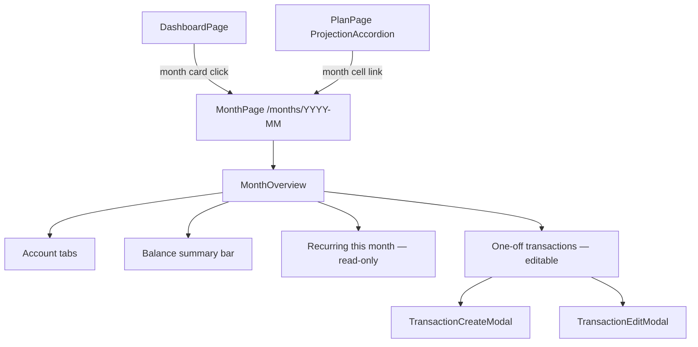

# 14 — Monthly Ledger

## Background

Horizon tracks accounts and recurring transactions but has no structured
way to log actual monthly spending. One-off transactions are currently
added per-account from the Account Detail page, making it hard to get a
month-level view of what was actually spent. The Monthly Ledger feature
introduces a dedicated Month Overview page and reorganises the transaction
entry points so recurring commitments and actual spending are clearly
separated.

Two cross-cutting improvements were also resolved during this session:
a reusable DatePicker primitive and account edit via the existing
AccountCreateModal.

## Problem

- No month-scoped view of actual spending exists
- One-off transactions and recurring transactions share the same entry
  point (Account Detail), blurring the distinction between commitments
  and actuals
- The Account Detail page edit flows (name, balance) are fragmented
  inline inputs that don't expose icon/color editing
- The RecurringTransactionList lacks column headers and shows a raw
  day number with no context

## Questions and Answers

**Q: Should "Add transaction" and "Add transfer" be removed from
AccountDetailPage?**
A: Yes. AccountDetailPage becomes account config + recurring transactions
only. One-off transactions are entered exclusively via the Month Overview.

**Q: Should the account edit flow reuse AccountCreateModal?**
A: Yes. A single pencil icon button replaces the two inline edit flows.
AccountCreateModal gains an optional `account` prop for edit mode
(pre-populated, PATCH on submit). Icon and color editing become available
for the first time.

**Q: What is the Month Overview URL?**
A: `/months/YYYY-MM` — ISO format, matches `snapshot.month` throughout
the codebase, sorts lexicographically, no dot-extension ambiguity.
MM-YYYY and DD.MM.YYYY considered and rejected (broken sort, conversion
overhead, no visible user benefit).

**Q: How does account selection work in the Month Overview?**
A: Tabs across the top, one per account, defaulting to the first.
A balance summary bar above the tabs mirrors the per-account values from
the projection accordion row for that month.

**Q: How are recurring transactions shown in the Month Overview?**
A: Separate read-only "Recurring this month" section above the editable
transaction list. Visually distinct (dimmed). Cannot be edited from here.

**Q: Is the date field free-form or constrained to the month?**
A: Day picker constrained to the selected month. Transaction model
unchanged — a full ISO date is stored.

**Q: Where do transfers go now that AccountDetailPage no longer has
"Add transfer"?**
A: TransferCreateModal is removed. TransactionCreateModal gains an
optional linked account picker — same pattern as RecurringTransactionModal.
Leaving it blank = transaction; selecting a destination = transfer.

**Q: What does the dashboard month card show?**
A: Month name, total one-off transaction amount, transaction count, and
a stacked horizontal bar broken down by category.

**Q: Where does the month card sit in the dashboard grid?**
A: Between Accounts Summary and Plan Overview. Exact grid position left
flexible for implementation.

**Q: How does the Plan Detail navigate to a month?**
A: The month label cell in ProjectionAccordion becomes a subtle link
(underline on hover) navigating to `/months/YYYY-MM`.

**Q: How are one-off transactions edited/deleted in the Month Overview?**
A: Clicking a row opens the existing TransactionEditModal pre-populated.

**Q: Can the user navigate between months without returning to the
dashboard?**
A: Yes. Prev/next month arrows in the Month Overview page header.
Back navigation uses `navigate(-1)`.

**Q: How should `dayOfMonth` be displayed in RecurringTransactionList?**
A: Ordinal suffix — 1st, 15th, 22nd. Column headers added:
Name | Amount | Frequency | Day. "Every Nth" phrasing rejected —
repeating "Every" on every row is visual noise.

**Q: What is the form input for `dayOfMonth` in RecurringTransactionModal?**
A: Stepper (− / number / +) constrained to 1–31.

**Q: Should a DatePicker primitive be introduced?**
A: Yes. Replaces all `type="date"` inputs across the app. Displays
DD.MM.YYYY, stores ISO string internally, opens a calendar on click.

**Q: Should the DD.MM.YYYY format be rolled out to all existing date
displays?**
A: Yes, but as a separate follow-up feature — not in scope for this
build.

## Design

### New page

```
src/pages/MonthPage/
  MonthPage.tsx
  MonthPage.styles.ts
  MonthPage.test.tsx
```

Route: `/months/:month` where `month` is `YYYY-MM`.

### New feature folder

```
src/features/monthly/
  MonthOverview/
    MonthOverview.tsx
    MonthOverview.styles.ts
    MonthOverview.test.tsx
  MonthCard/
    MonthCard.tsx
    MonthCard.styles.ts
    MonthCard.test.tsx
  useMonthTransactions.ts
  useMonthTransactions.test.ts
  index.ts
```

### Data flow



### AccountCreateModal — edit mode

```ts
// Extended props
interface Props {
  onClose: () => void;
  onSuccess: (accountId: string) => void;
  account?: AccountWithBalance; // edit mode when present
}
```

✅ Single modal, create + edit  
❌ Separate EditAccountModal — duplication, extra surface to maintain

### TransactionCreateModal — transfer consolidation

```ts
interface CreatePayload {
  date: string; // ISO, constrained to selected month
  amount: number; // cents
  description: string;
  category: string;
  linkedAccountId?: string; // present → transfer
}
```

✅ Optional linked account picker inside existing modal  
❌ Keep TransferCreateModal alongside — two entry points for same action

### DatePicker primitive

```
src/primitives/DatePicker/
  DatePicker.tsx
  DatePicker.styles.ts
  DatePicker.test.tsx
```

Displays DD.MM.YYYY. Stores/emits ISO string. Opens calendar on input
click. Replaces all `type="date"` inputs.

### RecurringTransactionList changes

- Column headers row: Name | Amount | Frequency | Day
- `dayOfMonth` → ordinal via `toOrdinal(n)` utility in `src/utils/format/`
- Header row: heading left, "Add recurring transaction" button right
  (single flex row)

### AccountDetailPage changes

- Remove: TransactionCreateModal, TransferCreateModal, Transactions section
- Remove: inline name edit and inline balance edit from AccountDetailHeader
- Add: single pencil icon → AccountCreateModal in edit mode
- Section layout: heading left, action button right (flex row)
- Button margins added throughout

### Dashboard changes

- Add MonthCard between Accounts Summary and Plan Overview
- MonthCard: month name, total, count, stacked category bar

## Implementation Plan

### Phase 1 — Month Overview page (skeleton)

- Add route `/months/:month` → MonthPage
- MonthPage renders account tabs and balance summary bar (projection
  data only, no transactions yet)
- Month cell in ProjectionAccordion becomes a link

### Phase 2 — One-off transactions in Month Overview

- `useMonthTransactions(accountId, month)` hook
- TransactionCreateModal gains linked account picker (replaces
  TransferCreateModal)
- Add/edit/delete one-off transactions from Month Overview
- Remove Transactions section from AccountDetailPage

### Phase 3 — Recurring this month section

- Read-only recurring section in Month Overview, populated from
  `useRecurringTransactions`

### Phase 4 — Dashboard month card

- MonthCard component with stacked category bar
- Wire into DashboardPage grid

### Phase 5 — Account edit modal

- AccountCreateModal extended with edit mode
- AccountDetailHeader simplified to display + pencil + delete

### Phase 6 — RecurringTransactionList polish

- Column headers
- Ordinal day display + `toOrdinal` utility
- Stepper input in RecurringTransactionModal
- Header row layout fix

### Phase 7 — DatePicker primitive

- DatePicker component
- Replace all `type="date"` inputs across the app

## Trade-offs

**Easier:**

- Month-level spending insight is now a first-class view
- Account Detail is simpler — one concern (recurring commitments)
- Account editing is richer — icon and color now editable
- Transaction vs transfer distinction is implicit (linked account picker),
  not a separate entry point

**Harder:**

- Users can no longer add a one-off transaction directly from Account
  Detail — they must navigate to the month first
- MonthPage needs the projection snapshot for the balance bar, so it
  pulls from the projection engine as well as the transaction API

**Out of scope:**

- DD.MM.YYYY display refactor across existing views (separate feature)
- Budget targets or spending limits per month
- Filtering or searching within the month transaction list
