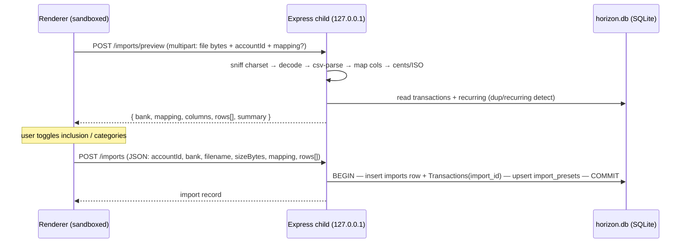

# 19 — Bank Statement Import (backend)

## Background

The "Claude Design Handover" (log 18) shipped the **Import UI shell** in full
visual fidelity against a thin, mock `features/import` seam: the Import page,
the 3-step wizard (Account → Map columns → Review), and the read-only
`ImportPreview`. Every part of that seam is fabricated today:

- `useImport` returns seeded history (`SEED_TEMPLATES`) and
  `sampleParsedRows()` instead of real parser output.
- `presetMemory` is an in-memory `Map` that dies on reload.
- `bankPresets.ts` holds three German bank shapes (Sparkasse / DKB / ING)
  **client-side**, recording `columns / map / decimal / dateFmt` — but **no
  field delimiter**.
- Confirm just fires a `notify()`; nothing persists.

Log 18 Q2 explicitly scoped the real engine as a **separate backend epic**:
real CSV parse, per-bank preset memory, duplicate/recurring detection, and
persisted import history, with imported rows landing in **Variable Spending**.
This is that epic's design log.

Relevant existing architecture:

- **Storage facade** (`server/src/storage/Storage.ts`) exposes per-entity
  repos; `Transaction` has no concept of an import. Both drivers must pass the
  **Parity Spec**, though only the **SQLite Driver** ships (Mongo is
  permanently deferred).
- Migrations are **forward-only** numbered SQL; latest is
  `010_add_category_color.sql`.
- The Desktop Build runs the Express server as a **local `utilityProcess`
  child** bound to `127.0.0.1` only (**Loopback Bind**); the Renderer talks to
  it over HTTP loopback via the injected `apiBaseUrl`. No cloud, fully offline.
- Real default categories are `Income, Housing, Food, Subscriptions,
Entertainment, Investment, Transfer, Miscellaneous` — the mock's
  `Groceries/Dining/Shopping/Cat/Transport/Health` are **not** real categories.

## Problem

Build the real engine behind the Import UI: parse German bank CSVs correctly,
detect duplicates and recurring flows, persist import history with a working
cascade delete, and remember each bank's column mapping — all offline,
on-device, and honest (no fabricated data, no fake buttons), reusing the
existing storage / route / parity patterns.

## Questions and Answers

1. **Where does CSV parsing live — renderer or server?**
   → ✅ **Server-side (A).** Renderer reads the file and POSTs to a new
   `/imports/preview` (parse + detect, no writes); a second `POST /imports`
   commits the chosen rows. Parsing/detection lives in a testable
   `server/src/lib/csvImport/` module. Rationale: duplicate/recurring
   detection is naturally a server-side join against stored transactions +
   recurring rows; CLAUDE.md puts business logic in `server/src/` and keeps
   `src/` thin; charset/delimiter/decimal complexity belongs in one tested Node
   module. ❌ Renderer-side parsing (B) — would refetch + recompute detection
   in the browser and push finance business logic into `src/`.
   - **Offline note:** "server-side" is a _process_ boundary, not a network
     one. The Express server is the local `utilityProcess` child on
     `127.0.0.1`. The CSV goes disk → Renderer memory → loopback socket → local
     Node → local `horizon.db`. Pull the network cable and it all still works.

2. **Persistence model — how do imported transactions relate to history?**
   → ✅ **New `imports` table + nullable `import_id` FK on `transactions`
   (A).** An `imports` row stores history metadata; each committed
   `Transaction` gets `import_id` set (NULL for hand-entered Variable
   Spending). Cascade delete is a **repo use-case method**, _not_ SQL
   `ON DELETE CASCADE` — consistent with how `transfers` owns its own
   atomicity, and parity-testable. ❌ history table without FK (B) — fuzzy
   range-matching collides with manual spend, breaks the cascade promise.
   ❌ no history table, derive from a `source` flag (C) — loses
   filename/bank/size/imported-on.

3. **File handover — multipart vs inline JSON text?**
   → ✅ **Multipart upload, server owns charset (A).** German bank CSVs are
   frequently **Windows-1252 / ISO-8859-1**; if the Renderer does
   `File.text()` the browser assumes UTF-8 and mojibakes umlauts
   _irreversibly_ before the server sees them. Send raw **bytes**; the server
   sniffs encoding (BOM → UTF-8, else Windows-1252) and decodes via
   `TextDecoder`. ❌ inline JSON text (B) — forces the decode decision into the
   Renderer. ❌ base64-in-JSON — smuggles binary through a string to avoid
   multer; multipart is the honest tool. This is the **only** deviation from
   the all-JSON API surface.

4. **Upload security posture** (raised by the user).
   → ✅ Accepted: **bounded-input + inert-text + memory-only, loopback as the
   trust boundary.** Threat model is narrow (loopback, offline, single-user, no
   auth) — real risks are resource exhaustion and bad input, not exfiltration.
   - multer `memoryStorage()` — no temp file (no path-traversal, no disk-fill);
     client `filename` is a **display label only**, never a filesystem path.
   - Hard caps enforced before buffering: `fileSize ~5MB`, `files: 1` (→ 413).
   - Row/column caps at parse time → reject, never silently truncate.
   - Every cell inert text: parameterized SQLite (SQLi structurally
     impossible) + **never re-export cells** (no CSV/formula injection).
   - Residual, accepted: any local process can hit the loopback port with no
     auth — inherent to the Desktop Build (logs 09/10); size/row caps blunt
     local-DoS.

5. **Where do shipped presets and _remembered_ mappings live?**
   → ✅ **Shipped presets = server-side constant; remembered mappings = DB
   `import_presets` table; detection from the file's header row (A).** Mirrors
   log 18 Q3: `showInTrajectory` / mortgage origination / `sortOrder` all went
   to **real columns** because "a backup/restore would lose them … the `.db`
   file is the truth." A remembered DKB mapping is that same kind of
   survive-a-reinstall state. ❌ electron-store / `HorizonPreferences` (B) —
   reserved for app-shell prefs (auto-update), not in the `.db`. ❌ localStorage
   (C) — disposable view state only (e.g. Trajectory legend). Detection matches
   the parsed **header row** against preset `columns` (the current mock guesses
   bank from prior account history — backwards).

6. **CSV parsing mechanics — library and preset schema?**
   → ✅ **`csv-parse` library + extended `BankPreset`.** Hand-rolling CSV
   breaks on quoted fields with embedded delimiters/newlines; `csv-parse`
   handles RFC-4180 quoting, our module owns the _domain_ bits. Extend the
   preset to make quirks data, not code:
   `delimiter` (German banks use `;`), `headerSignature` (column names that
   identify the real header row, so the metadata **preamble** is skipped by
   scanning to it), optional `encoding`. Decimal-comma → integer cents;
   `DD.MM.YYYY` → ISO. ❌ deferred: split debit/credit columns or separate
   sign indicator — our three banks are single-signed-column.

7. **Auto-categorization?**
   → ✅ **Keyword→category rule map (server constant), onto the eight real
   default categories, `Miscellaneous` fallback.** Case-insensitive substring
   on description (`REWE/EDEKA/Aldi → Food`, `Miete → Housing`, `Gehalt →
Income`, `Netflix → Subscriptions`, `Sparplan ETF → Investment`, …). Per-row
   override via the wizard's existing `Select`. ❌ no Category auto-creation
   (category management is out of scope per log 18).

8. **Duplicate detection?**
   → ✅ **High-precision.** Flag `duplicate` when an existing transaction in the
   _target account_ has the **same signed amount AND same ISO date AND
   normalized-description equality** (lowercased, whitespace-collapsed); also
   dedupe within the file. Conservative on purpose — flagged rows are
   pre-unchecked, so over-flagging would silently drop real spend.

9. **Recurring detection?**
   → ✅ Flag `recurring` when a row matches the account's existing
   `RecurringTransaction`s: same sign, `|amount|` equal (small tolerance), and
   description containment either direction. Day-of-month proximity is a soft
   signal, not required (booking dates drift). Purpose: avoid double-counting
   flows the Projection Engine already owns. Pre-unchecked.

10. **Commit semantics?**
    → ✅ **Stateless preview, atomic commit.** Preview holds no server session;
    it returns rows with server-assigned ids. `POST /imports` carries
    `accountId + bank + filename + sizeBytes + mapping + chosen rows[]`; the
    server re-validates (int cents, ISO dates, account exists) and inserts the
    `imports` row + all included `Transaction`s in **one better-sqlite3
    transaction** (use-case method, all-or-nothing). The same commit **upserts
    `import_presets`** with the adjusted mapping. Real signs preserved (an
    included positive credit becomes a positive Variable Spending transaction).
    No silent auto-dedupe — the user's review choices are authoritative.

11. **History actions — honest scope?**
    → ✅ **Preview + Delete real; Re-download dropped; Re-categorize deferred.**
    Preview = `GET /imports/:id/transactions` (read-only). Delete = cascade
    (Q2). **Re-download CSV is impossible offline** — the raw file is never
    persisted by design. Re-categorize is a future "re-run rules over this
    import" enhancement. Per log 18's "no fake buttons ship", a **small UI
    follow-up removes the Re-download and Re-categorize affordances** from
    `ImportHistory`.

## Design

### Flow (offline, on-device)



### Migration `011_add_imports.sql` (forward-only, both-driver parity)

```sql
CREATE TABLE imports (
  id           TEXT PRIMARY KEY,
  account_id   TEXT NOT NULL REFERENCES accounts(id),
  bank         TEXT NOT NULL,
  filename     TEXT NOT NULL,
  from_date    TEXT NOT NULL,
  to_date      TEXT NOT NULL,
  row_count    INTEGER NOT NULL,
  imported_on  TEXT NOT NULL,
  size_bytes   INTEGER NOT NULL
);

CREATE TABLE import_presets (
  bank        TEXT PRIMARY KEY,
  column_map  TEXT NOT NULL,   -- JSON ColumnMapping
  delimiter   TEXT NOT NULL,
  decimal     TEXT NOT NULL,
  date_fmt    TEXT NOT NULL,
  updated_on  TEXT NOT NULL
);

ALTER TABLE transactions ADD COLUMN import_id TEXT REFERENCES imports(id);
```

### Storage facade additions (`server/src/storage/`)

```ts
export interface ImportRecord {
  id: string;
  accountId: string;
  bank: string;
  filename: string;
  fromDate: string;
  toDate: string;
  rowCount: number;
  importedOn: string;
  sizeBytes: number;
}

export interface ImportCommitInput {
  accountId: string;
  bank: string;
  filename: string;
  sizeBytes: number;
  rows: {
    date: string;
    amount: number;
    description: string;
    category: string;
  }[];
}

export interface ImportsRepo {
  create(input: ImportCommitInput): Promise<ImportRecord | null>; // atomic: imports row + txns
  findAll(): Promise<ImportRecord[]>;
  findByAccount(accountId: string): Promise<ImportRecord[]>;
  findTransactions(importId: string): Promise<Transaction[]>;
  delete(importId: string): Promise<{ ok: true } | null>; // cascade in repo
}

export interface ImportPresetsRepo {
  get(bank: string): Promise<StoredPreset | null>;
  upsert(bank: string, preset: StoredPreset): Promise<void>;
}
```

`transactions.create`'s insert leaves `import_id` NULL; the imports repo sets
it. `Transaction` gains optional `importId`.

### Parse engine (`server/src/lib/csvImport/`) — pure, fully tested

- `detectEncoding(bytes) → 'utf-8' | 'windows-1252'` (BOM → UTF-8 else 1252).
- `detectBank(headerRow, presets) → bankKey | DEFAULT_BANK`.
- `parseStatement(text, preset) → RawRow[]` (skip preamble to `headerSignature`,
  `csv-parse` with `preset.delimiter`, quote-aware).
- `parseAmount(str, decimal) → cents:int`; `parseDate(str, dateFmt) → isoString`.
- `categorize(description) → CategoryName` (keyword map → `Miscellaneous`).
- `detectDuplicates(rows, existingTxns)` / `detectRecurring(rows, recurring)`.

### Extended `BankPreset` (server constant)

```ts
interface BankPreset {
  columns: string[];
  map: ColumnMapping;
  decimal: string;
  dateFmt: string;
  delimiter: ";" | ","; // NEW
  headerSignature: string[]; // NEW — identifies the real header row
  encoding?: "windows-1252" | "utf-8"; // NEW — default sniffed
}
```

### Routes (`server/src/routes/imports/`)

- `POST /imports/preview` — multipart (multer memoryStorage, caps) → review rows.
- `POST /imports` — JSON → atomic commit (+ preset upsert).
- `GET /imports` · `GET /imports?accountId=` — history.
- `GET /imports/:id/transactions` — preview rows.
- `DELETE /imports/:id` — cascade.

### Frontend seam swaps (`src/features/import/`)

- `presetMemory.get/remember` → API-backed (read at preview, upsert at commit).
- `useImport` history / `sampleParsedRows` → real `GET /imports` / preview call.
- `bankPresets.ts` client constant retired in favour of server detection.
- **UI follow-up:** remove Re-download + Re-categorize buttons from
  `ImportHistory`.

## Implementation Plan

**Phase 1 — Persistence slice (thinnest end-to-end).**
Migration `011` (`imports` + `import_presets` + `transactions.import_id`),
`ImportsRepo` + `ImportPresetsRepo` on the SQLite driver, parity-spec entries,
`POST /imports` (commit) + `GET /imports` + `DELETE /imports/:id` (cascade).
Proves a row set → persisted transactions → history → cascade delete, before
any parsing exists (commit takes JSON rows).

**Phase 2 — Parse + detect engine.**
`server/src/lib/csvImport/` pure module (encoding, header/preamble, `csv-parse`,
cents/date, categorize, duplicate + recurring detection) with full unit tests
against real Sparkasse/DKB/ING fixtures. Extended `BankPreset` constant.

**Phase 3 — Preview route + wire the UI.**
`POST /imports/preview` (multipart, caps, security posture). Swap the
`features/import` seams to the real API; remove the deferred history buttons.
Acceptance: a real DKB CSV imports end-to-end, dupes/recurring pre-unchecked,
mapping remembered next time.

## Trade-offs

**Easier:** detection is a natural server-side join; one tested Node module owns
all charset/delimiter/decimal pain; the persistence slice (Phase 1) ships and is
verifiable before any CSV is parsed; reuses the established repo / route /
parity / forward-migration patterns wholesale; honest by construction (no
fabricated numbers, no fake buttons).

**Harder:** adds the **only** multipart route + a multipart dependency to the
server bundle; `csv-parse` is a new server dep; the new `imports` /
`import_presets` repos must pass driver parity; German-bank fixtures
(encoding/preamble/decimal-comma) need real sample files to test against.

**Out of scope (deliberate):** split debit/credit-column banks (single-signed
column only); **Re-download** (raw file never stored offline) and
**Re-categorize** (future enhancement); category-management / colour-picker UI
(log 18); the Mongo driver (permanently deferred, but parity entries still
authored); Month Year-Comparison and Native Application Menu (separate roadmap
items).
