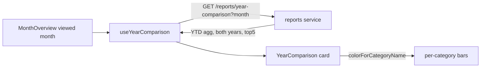

# 20 — Month Year-Comparison

## Background

The "Claude Design Handover" (log 18) shipped the Month Overview right column
with two cards: the **Breakdown** donut (real) and a **Year comparison** card
that was deliberately left as an honest **Planned** placeholder. Log 18
decision #6 ruled out fabricated bars, so today's `YearComparison.tsx` renders
only an overline ("Year comparison"), a title ("This year so far"), a one-line
frame, and a "coming soon" note — no data.

The canonical prototype (`docs/handoff/prototype/src/screens/MonthOverview.jsx`,
lines 135–537) draws the intended card in full: per-category horizontal bars,
two bars per category (this year in the category color, last year in muted
`ink5`), a mono year-to-date value per row, a single shared bar scale
(`yoyMax`), the top-5 categories, and a This-year / Last-year legend. Its
numbers are faked (`c.value * 9 + 4000`).

Relevant existing architecture:

- **Data flow today** is per-account, per-month: `useAllMonthTransactions`
  fans out `GET /accounts/:id/transactions?month=YYYY-MM` across the spending
  accounts and aggregates client-side in `src/utils` (`monthStats`,
  `monthBreakdown`). The transactions route supports only a single `?month=`
  filter.
- **Variable Spending** is the selectable spending set:
  `selectVariableSpending` drops transfer legs and auto-settlement rows.
  Mortgage and Investment accounts hold none (`NON_SPENDING_KINDS`).
- **Category colors** are derived deterministically from the category name
  (`colorForCategoryName`), so no extra fetch is needed to color a bar.
- **Architecture rule** (CLAUDE.md): SQLite access and business logic live in
  `server/src/`; `src/` never talks to SQLite directly.

## Problem

Replace the Planned placeholder with the prototype's real card: per-category
cumulative Variable Spending from Jan 1 through the viewed month, this year vs
the same window last year, top 5 categories — sourced from real data, computed
without a 24×N request fan-out, and honest in its degenerate states.

## Questions and Answers

1. **What anchors the comparison — the viewed month or today's month?**
   → ✅ **Viewed month.** The card recomputes as the month navigator steps; the
   YTD window ends at the viewed month. Matches the prototype (derives from
   `fullMonth`/`cy`) and the rest of the page, which describes the viewed month.
   ❌ Pin to today's real month — would make a navigable page show a static card.

2. **Does the viewed (end) month count in full, or only up to today's day?**
   → ✅ **Whole-month granularity.** Window is Jan 1 → end of the viewed month,
   both years, as full calendar months; an in-progress month counts in full.
   Horizon is a manual/recurring monthly model with no live feed, so there is
   no meaningful "as of today" partial signal, and the stat strip + breakdown
   already treat the viewed month as one unit. ❌ Day-of-month cutoff — would
   shift the comparison every day (noise for a long-horizon tool).

3. **Account scope — all spending accounts, or the selected spending-list tab?**
   → ✅ **All spending accounts**, independent of the left-column tab; excludes
   Mortgage/Investment as the card does today. The prototype computes from the
   full variable-spending set, and the card answers a portfolio-level question.
   ❌ Follow the tab — a right-column card silently changing on a left-column
   click is surprising.

4. **Which categories get a bar, and how many?**
   → ✅ **Top 5 by this-year YTD total, descending.** This-year ranking keeps
   the card on where money goes now; a category big last year but ~zero this
   year correctly falls off. Render fewer than 5 if fewer exist. ❌ Rank by
   combined / last-year total — would surface dropped categories the user has
   moved on from.

5. **Data source — dedicated backend endpoint or widened client query?**
   → ✅ **(A) Dedicated report endpoint** `GET /reports/year-comparison?month=YYYY-MM`,
   aggregating per-category `{ thisYear, lastYear }` in cents server-side and
   returning a small payload. Honors the SQLite-stays-in-`server/src` rule,
   sends one tiny response instead of two large raw-transaction spans, and keeps
   the YTD/year-pairing math in one testable service. First `/reports` route.
   ❌ (B) Widen the transactions query to `?from&to` + aggregate in a new
   `src/utils` — more consistent with monthStats/monthBreakdown precedent but
   ships two large payloads and pushes finance math into `src/`. ❌ (C) Pure
   client fan-out over the per-month endpoint — ~24×N round-trips.

6. **Bar presentation — mirror the prototype, or add a delta?**
   → ✅ **Mirror the prototype.** Label + this-year mono value; two stacked bars
   (this-year category color / last-year muted `ink5`); single shared max across
   all bars; This-year / Last-year legend. No per-row delta in v1 — the two-bar
   visual already shows direction, and a delta carries its own sign/color/zero
   decisions that can land later as its own enhancement.

7. **Degenerate states?**
   → ✅ **No YTD spending at all** → honest empty state ("No spending yet this
   year."), mirroring `MonthBreakdown`'s empty copy. ✅ **No last-year data**
   (first year of use) → render normally with this-year bars and last-year bars
   at zero length; keep both legend entries — an empty prior-year baseline is
   itself truthful. ✅ **Fewer than 5 categories** → render what exists, no
   padding.

8. **Naming for ubiquitous language?**
   → ✅ **YTD Variable Spending** — cumulative Variable Spending per category,
   Jan 1 → viewed month, in cents. ✅ **Year Comparison** — this year's YTD
   Variable Spending vs the prior year's, per category, over the same window.
   Endpoint `GET /reports/year-comparison?month=YYYY-MM`; code fields
   `thisYear` / `lastYear` (cents), matching the prototype.

## Design

### Endpoint

```
GET /reports/year-comparison?month=YYYY-MM
```

Resolves the viewed month to two whole-month windows and returns the top 5
categories by this-year YTD spend:

```ts
// server/src/routes/reports/yearComparison response
interface YearComparisonRow {
  category: string; // category name (color derived client-side)
  thisYear: number; // YTD Variable Spending magnitude, cents (≥ 0)
  lastYear: number; // same window prior year, cents (≥ 0)
}

interface YearComparisonResponse {
  month: string; // echoed YYYY-MM (viewed month)
  rows: YearComparisonRow[]; // ≤ 5, sorted by thisYear desc
}
```

- **Window:** `thisYear` = sum of Variable Spending magnitudes for dates in
  `[YYYY-01, viewed-month]` of the viewed year; `lastYear` = same month span,
  prior year. Whole months, both years.
- **Variable Spending only:** exclude transfer legs and auto-settlement, across
  all non-Mortgage/non-Investment accounts (server mirrors
  `selectVariableSpending`).
- **Magnitudes** in cents (absolute value, like `monthBreakdown`), so bars
  render regardless of expense sign.
- **Ranking + cap** (top 5 by `thisYear` desc) done server-side, so `src/`
  renders exactly what it receives.

### Server layout

- `server/src/routes/reports/reports.ts` — the `/reports` router (first route
  under it).
- `server/src/routes/reports/yearComparison.ts` — request/response Zod schema +
  the pure aggregation service operating on stored transactions (testable
  without HTTP).
- `server/src/routes/reports/reports.test.ts` — window math, Variable-Spending
  filter, ranking/cap, prior-year pairing, degenerate cases.

### Frontend

- `src/features/months/useYearComparison.ts` — fetches the endpoint for the
  viewed month; returns `{ rows, isLoading }`. Replaces the prop-only card.
- `YearComparison.tsx` — drops the Planned placeholder; renders the prototype
  card from `rows`. Colors via `colorForCategoryName`. Shared max =
  `Math.max(...rows.flatMap(r => [r.thisYear, r.lastYear]))`; guard divide-by-0.
- Empty state when `rows` is empty: "No spending yet this year."
- `MonthOverview.tsx` swaps `<YearComparison monthLabel=… />` for the
  data-backed card keyed on `monthStr` (still passing `monthLabel` for copy).



## Implementation Plan

1. **Server slice (thinnest end-to-end):** `/reports/year-comparison` returning
   the real top-5 `{ thisYear, lastYear }` for a hardcoded-then-parameterized
   month, with the aggregation service + tests (window math, VS filter, ranking,
   prior-year pairing, empty/first-year). Verify via HTTP.
2. **Hook:** `useYearComparison` fetching the endpoint for the viewed month.
3. **Card:** rebuild `YearComparison.tsx` from `rows` — bars, shared scale,
   legend, mono values; update its tests off the Planned-placeholder assertions.
4. **Wire + states:** swap the card in `MonthOverview`, handle empty / no-last-
   year / <5 categories, loading.
5. **Docs:** flip the CLAUDE.md build-status line; dev-journal close-out.

## Trade-offs

- **Easier:** one small typed payload per viewed month instead of two large raw
  spans; YTD/year-pairing logic lives in one server service with focused tests;
  `src/` stays out of SQLite; a `/reports` surface now exists for future report
  cards (e.g. the eventual delta enhancement).
- **Harder / cost:** introduces the first `/reports` route — a new server
  surface to design, test, and keep parity-clean. The endpoint recomputes the
  YTD aggregation per request (no caching) — fine at single-user desktop scale.
- **Out of scope:** per-row delta indicators (v2); day-of-month partial-window
  cutoffs; account-tab-scoped comparison; ranking by combined/last-year totals;
  any window other than Jan 1 → viewed month.
