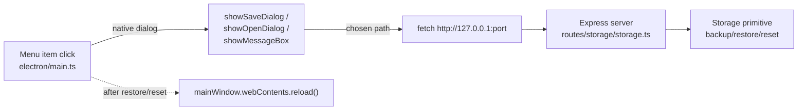

# 24 — Native Application Menu

## Background

Horizon is a Windows-only, offline-first Electron app. The native menu
today (`buildProdMenu` in `electron/main.ts`) is a bare skeleton —
File→Quit, standard Edit/View/Window roles, and a disabled Help→"Horizon"
item — and it is installed **only** in packaged builds
(`if (loadProdRenderer)`); in dev the default Electron menu shows.

A full in-app Settings page already exists at `/settings/storage`
(`SettingsStoragePage`), composed of:

- **StorageCard** — db path, size, integrity badge, WAL mode, plus
  backup/restore driven over HTTP (`downloadBackup` → `POST /storage/backup`,
  `uploadRestore` → `POST /storage/restore` multipart).
- **PreferencesCard** — auto-update toggle, category manager, appearance,
  privacy.
- **AboutCard** — app version + "Check for updates" via `useUpdateStatus`.

The Express server runs as a **separate utility process**; the main
process never touches SQLite directly and reaches storage only over
`http://127.0.0.1:{port}`. `main` receives `port` from
`serverHandle.start()`. The `Storage` interface exposes `serialize()`,
`backup(destPath)`, `restore(srcPath)`, `status()` — but **no reset
primitive**. A freshly-opened DB is seeded with default categories
(migration `001_initial.sql`) and nothing else.

## Problem

Surface Horizon's data/settings capabilities in the native title-bar menu
(alongside File, Edit, View, Window, Help), per the roadmap item. Because
a rich in-app Settings surface already exists, decide what belongs in the
native menu, how native actions execute given the main↔server process
split, and add a user-requested capability to reset Horizon to a clean
"new" state.

## Questions and Answers

1. **What should the native menu fundamentally be, given a full Settings
   page already exists?**
   A **blend**: navigate into the existing Settings page for some items,
   but use genuinely-native flows (OS Save/Open dialogs, message boxes)
   for backup/restore and for a new "Start Fresh" reset. Not a thin
   navigation-only menu, not a full re-implementation.

2. **Where do the new items live in the menu tree?**
   Fold into **File** and **Help**; leave Edit/View/Window as-is. No
   dedicated "Horizon" top-level menu (less conventional on Windows; the
   roadmap anchors on File/Help).

3. **How do native backup/restore/reset actually execute across the
   main↔server split?**
   **Path-based server endpoints.** Add `backup-to`, `restore-from`, and
   `reset`; `main` shows the native dialog, then `fetch`es the local
   endpoint with the OS-picked filesystem path. No byte-streaming through
   main, no renderer involvement.

4. **How does the renderer avoid stale data after a native restore/reset?**
   Full `mainWindow.webContents.reload()` after restore/reset. Backup is
   read-only — no reload.

5. **Safety UX for the destructive items (Start Fresh, Restore)?**
   Single well-worded native `showMessageBox` confirm, default **Cancel**.
   No auto-backup-first flow (Create Backup sits in the same menu).

6. **How is "About Horizon" presented?**
   Native `showMessageBox` — app version + Electron/Chromium/Node versions
   - a "Show data folder" affordance. Intentional, conventional redundancy
     with the in-app AboutCard.

7. **How does "Check for Updates…" behave?**
   Reuse the existing `autoUpdater` → renderer banner/snackbar flow for the
   available/downloading cases; add native fallback dialogs for the
   currently-silent "up to date" and "error" outcomes; in dev show an
   "only available in the installed app" notice.

8. **Build shape — testability and dev/prod?**
   Extract menu construction to a pure, unit-tested
   `electron/buildMenu/buildMenu.ts`. Install the custom menu in **both**
   dev and prod, with developer View items (Reload, Toggle DevTools) gated
   to dev via an `isDev` flag.

## Design

### Menu structure

```
File
  Settings…              Ctrl+,     → navigate renderer to /settings/storage
  ─────────
  Create Backup…         Ctrl+S     → native Save dialog → POST /storage/backup-to
  Restore from Backup…              → native Open dialog → confirm → POST /storage/restore-from → reload
  Start Fresh…                      → confirm → POST /storage/reset → reload
  ─────────
  Quit                   Ctrl+Q
Edit / View / Window                → unchanged (View: Reload + Toggle DevTools dev-only)
Help
  Check for Updates…                → autoUpdater.checkForUpdates() + existing flow / native fallback
  Show Data Folder                  → shell.showItemInFolder(resolveDbPath())
  ─────────
  About Horizon                     → native showMessageBox (versions + data folder)
```

### Execution architecture



### New server endpoints — `server/src/routes/storage/storage.ts`

- ✅ `POST /storage/backup-to  { path: string }` → `storage.backup(destPath)`
  (SQLite online backup API — safer than `serialize()` under WAL).
- ✅ `POST /storage/restore-from { path: string }` → `storage.restore(srcPath)`
  (path entry into the existing primitive; same integrity/future-schema
  validation as the multipart route).
- ✅ `POST /storage/reset` → new `storage.reset()`.
- ❌ Stream bytes through main via existing `/storage/backup` +
  multipart `/storage/restore` — clumsy for restore, no gain on a
  same-machine local server.
- ❌ Delegate to renderer over IPC — cannot drive a native Save/Open
  dialog, defeating the blend.

The existing multipart `/storage/restore` and `POST /storage/backup`
(download) endpoints stay — the in-app StorageCard still uses them.

### New storage primitive — `Storage.reset()`

Signature added to `server/src/storage/Storage.ts`:

```ts
interface Storage {
  // …existing…
  reset(): Promise<void>;
}
```

SQLite implementation mirrors `restore()`'s close→swap→reopen shape:

```
closeConnection(db) → delete db file (+ -wal/-shm sidecars) →
db = openConnection(path, options)  // re-runs migrations, reseeds categories →
repos = buildRepos(db)
```

Result: brand-new-install state — default seeded categories, **no**
accounts, transactions, imports, recurring, or presets.

### Menu construction — `electron/buildMenu/buildMenu.ts` (pure, tested)

```ts
interface BuildMenuHandlers {
  isDev: boolean;
  onSettings: () => void;
  onBackup: () => void;
  onRestore: () => void;
  onStartFresh: () => void;
  onCheckUpdates: () => void;
  onAbout: () => void;
  onShowDataFolder: () => void;
}

export function buildMenu(h: BuildMenuHandlers): MenuItemConstructorOptions[];
```

`main.ts` wires the handlers to the native dialogs + `fetch` calls and
installs via `Menu.setApplicationMenu(Menu.buildFromTemplate(buildMenu(...)))`
in both dev and prod. Renderer navigation for **Settings…** uses a
`menu:navigate` IPC channel: main `webContents.send("menu:navigate", "/settings/storage")`,
preload exposes `onNavigate`, a small renderer hook calls `useNavigate`.

### Update messaging

- ✅ available / downloading → existing `update-available` /
  `update-downloaded` IPC → UpdateBanner / snackbar (no duplication).
- ✅ up-to-date / error / dev-unpackaged → native `showMessageBox`
  (the currently-silent outcomes).

## Implementation Plan

Each phase is a thin working vertical slice.

1. **`storage.reset()` primitive + endpoint (thinnest slice).**
   Add `reset()` to `Storage` interface and `SqliteStorage`; add
   `POST /storage/reset`. Test in `storage.test.ts` (SqliteStorage +
   route): reset wipes accounts/transactions but leaves default
   categories. No UI yet.

2. **Path-based backup/restore endpoints.** Add `POST /storage/backup-to`
   and `POST /storage/restore-from`; tests for success + integrity
   rejection reuse of `mapIntegrityErrorMessage`.

3. **`buildMenu` pure module + tests.** Extract template to
   `electron/buildMenu/buildMenu.ts`; unit-test item presence, order,
   accelerators, and dev-gating with stubbed handlers.

4. **Wire `main.ts` handlers.** Native dialogs → `fetch` to the local
   server → `webContents.reload()` after restore/reset. Store `port`;
   install custom menu in both dev and prod.

5. **Settings navigation IPC.** `menu:navigate` channel, preload
   `onNavigate`, renderer hook → `useNavigate`.

6. **Native About + Check-for-Updates fallback dialogs.** `showMessageBox`
   About (versions + data folder); add up-to-date/error/dev update
   dialogs alongside the existing autoUpdater flow.

## Trade-offs

**Easier:**

- Keyboard/discoverable access to core data operations at the OS level.
- Native Save/Open pickers replace the browser download/upload hacks for
  power users.
- Path-based endpoints keep all SQLite work in the server process and
  reuse existing `Storage` primitives.
- Pure `buildMenu` makes the whole menu template unit-testable.

**Harder / accepted cost:**

- Two backup/restore code paths coexist (in-app HTTP download/upload +
  native path-based). Intentional: the StorageCard keeps working, the
  menu adds a native path.
- Intentional redundancy between native About and in-app AboutCard.
- Full `webContents.reload()` after restore/reset flashes the window —
  accepted as bulletproof over a surgical cache-invalidation IPC.

**Out of scope:**

- Auto-backup-before-destroy flow (Create Backup is one click away).
- Surgical cache invalidation (chose full reload).
- A dedicated top-level "Horizon" menu (folded into File/Help).
- macOS app-menu conventions (Horizon is Windows-only).
